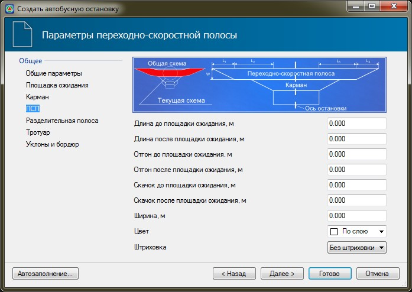

# ПСП

На вкладке **ПСП** задаются следующие параметры:

* **Длина до и после площадки ожидания** - в данных полях задается значение длины основной части переходно-скоростной полосы до и после площадки ожидания.
* **Отгон до и после площадки ожидания** - в данных полях задается значение длины отгонов переходно-скоростной полосы до и после площадки ожидания.
* **Ширина** - значение полной ширины ПСП.
* **Цвет** и **Штриховка** - в поле **Цвет** из выпадающего списка при необходимости может быть выбран цвет, которым будет выделен контур **ПСП**. Для того чтобы данный контур был заполнен внутри, в поле **Штриховка** установите параметр **Заливка**.