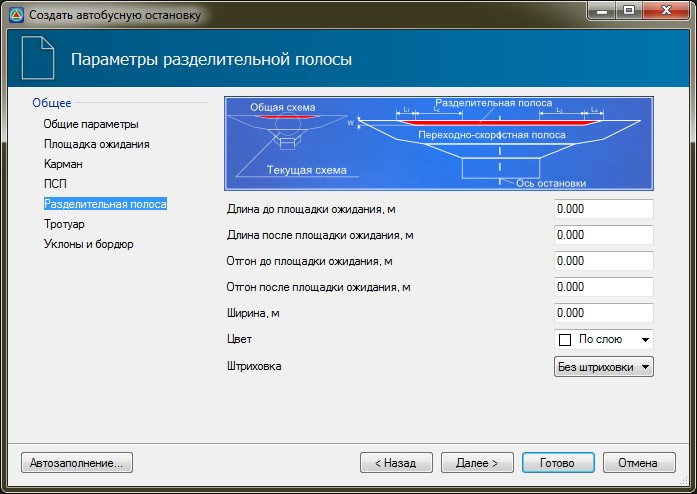

# Разделительная полоса

На вкладке **Разделительная полоса** задаются следующие параметры:

* **Длина до и после площадки ожидания** - в данных полях задается значение длины основной части разделительной полосы до и после площадки ожидания.
* **Отгон до и после площадки ожидания** - в данных полях задается значение длин отгонов разделительной полосы до и после площадки ожидания.
* **Ширина** - значение полной ширины разделительной полосы.
* **Цвет и Штриховка** - в поле **Цвет** из выпадающего списка при необходимости может быть выбран цвет, которым будет выделен контур разделительной полосы. Для того чтобы данный контур был заполнен внутри, в поле **Штриховка** установите параметр **Заливка**.
