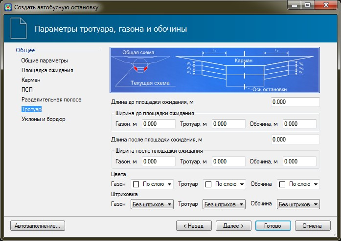

# Тротуар

На вкладке **Тротуар** задаются следующие параметры:

* **Длина до и после площадки ожидания** - в данных полях задаются значения длин участков, на котором предусмотрен газон и тротуар, до и после площадки ожидания.
* **Ширина до и после площадки ожидания** - в данных полях задаются значения ширин участков газона, тротуара и обочины, до и после площадки ожидания.
* **Цвет и Штриховка** - в полях **Цвета** из выпадающего списка при необходимости может быть выбраны цвета, которыми будут выделены контуры газона, тротуара и обочины. Для того чтобы данные контура были заполнены внутри, в поле **Штриховка** установите параметр **Заливка**.
