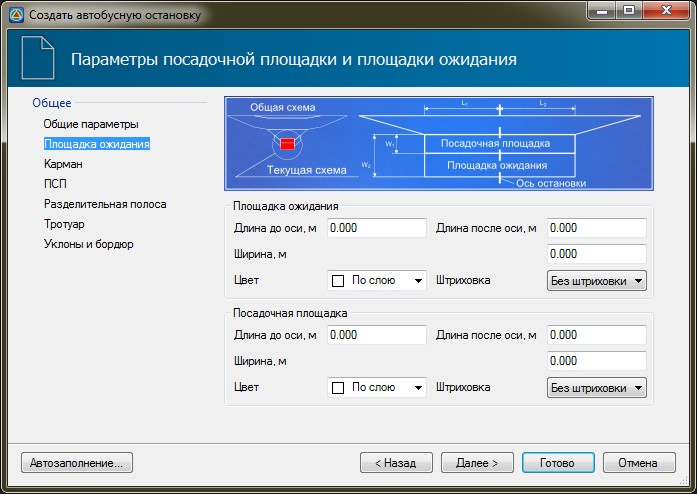

# Площадка ожидания

На вкладке **Площадка ожидания** задаются следующие параметры: 

* **Площадка ожидания** - в данных полях задается длина площадки ожидания до и после ее оси, а также ее ширина. В поле **Цвет** из выпадающего списка при необходимости может быть выбран цвет, которым будет выделен контур площадки ожидания. Для того чтобы данный контур был заполнен внутри, в поле **Штриховка** установите параметр **Заливка**.
* **Посадочная площадка** - в данных полях задается длина посадочной площадки до и после ее оси, а также ее ширина. В поле **Цвет** из выпадающего списка при необходимости может быть выбран цвет, которым будет выделен контур посадочной площадки. Для того чтобы данный контур был заполнен внутри, в поле **Штриховка** установите параметр **Заливка**.

