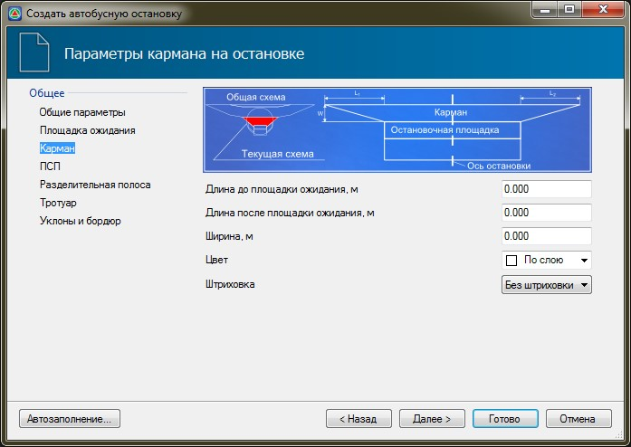

# Карман

На вкладке **Карман** задаются следующие параметры:

В данной группе полей задается значение длины отгона кармана до и после площадки ожидания, а также его ширина. В поле **Цвет** из выпадающего списка при необходимости может быть выбран цвет, которым будет выделен контур кармана остановки. Для того чтобы данный контур был заполнен внутри, в поле **Штриховка** установите параметр **Заливка**.
