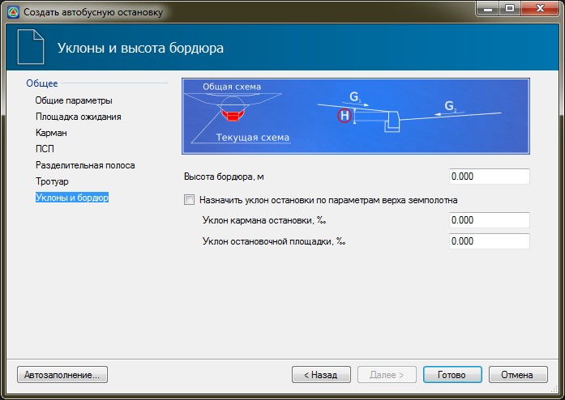

# Уклоны и бордюр

На вкладке **Уклоны и бордюр** задаются следующие параметры:

**Высота бордюра, м** – в данном поле ввода задается высота бортового камня на тротуаре и посадочной площадке.

При выключенной опции **Назначить уклон** по параметрам верха земполотна имеется возможность задать **Уклон кармана остановки** и **Уклон** остановочной площадки.