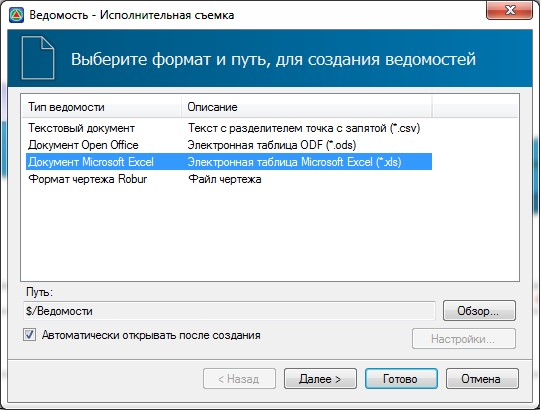
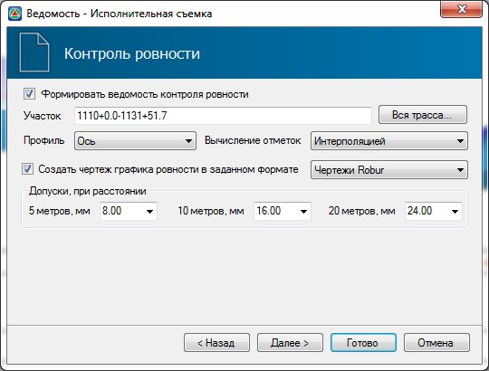
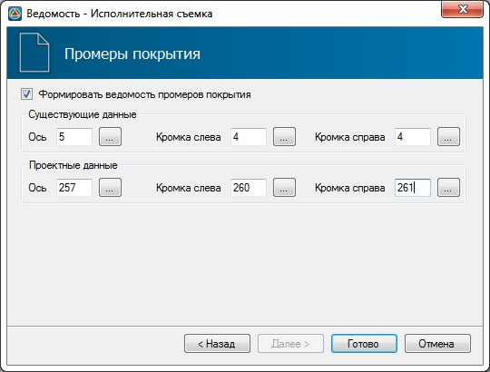
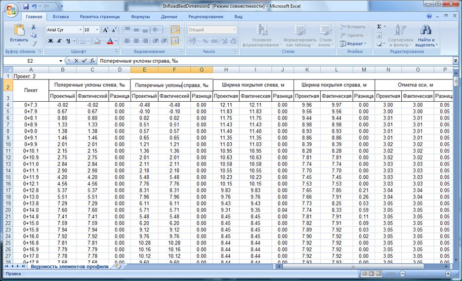

# Контроль ровности и ведомость промеров покрытия

Данный модуль позволяет обрабатывать данные технического надзора, проводимого как на этапе сдачи автомобильной дороги, так и ее последующей эксплуатации. **Модуль Исполнительной съемки** позволяет формировать необходимые выходные данные (ведомости и чертежи) по расчету **Контроля ровности** и **Промерам покрытия автомобильной дороги**.

Для этого:

1. Выберите меню **Задачи - Исполнительная съемка**.
2. В открывшемся мастере выберите формат ведомости и нажмите **Далее**:

   

3. В открывшемся окне задайте параметры расчета и формирования выходных данных по контролю ровности покрытия:

   

Расчет контроля ровности покрытия осуществляется на основе данных выбранного черного продольному профиля, с последующим выводом ведомости обработки результатов и эпюры отклонений амплитуд от допустимых значений. Определение ровности покрытия производится в соответствии с требованиями **ГОСТ 30412-96** и **СНИП 3.06.03-85**

**Участок** – задает участок на котором будет производится расчет. Его можно задать непосредственно в поле ввода или выбрать всю протяженность при помощи кнопки Вся трасса.

**Профиль** – задается исходный черный профиль, по которому будет производиться расчет ровности покрытия.



Расчет ровности покрытия производится по Черному профилю, полученного в результате:

* Заполнения журнала нивелирования, расчета отметок и создания профиля по съемке ([см. Обработка геодезических измерений](../../rb_survey/survey/basic_concepts.md))
* Импорта отметок Черного профиля из возможных форматов импорта.
* Создания черного профиля [по данным цифровой модели](../../rb_survey/alg/track_profile/create_black_profile.md).



Расчет отклонения в заданной точке производится с заданным шагом (5, 10 и 20 м).

Отклонение рассчитывается по схеме приведенной ниже.

#|
||  ||
|| рис. 1 ||
|#

По данным нивелирования вычисляют относительные отметки hi точек поверхности покрытия.

По отметкам точек поверхности определяют отклонения, δhi этих точек (кроме первой и последней на участке измерений) от прямой линии, проходящей через предыдущую (i -1) и последующую (i+1) точки (рис. 1)

Вычисление отклонений возможно двумя способами:

**Интерполяцией** – данный метод вычисления отметок применяется тогда, когда шаг нивелирной съемки покрытия не соответствует 5м.

При использовании данного метода программа разбивает черный профиль с шагом 5м, и полученные отметки вычисляет интерполяцией (рис.2)

#|
||  ||
|| рис. 2 ||
|#

**По Переломам профиля** – данный метод вычисления отметок применим тогда, когда шаг нивелирной съемки покрытия соответствует 5м или близок к этому значению.

При использовании данного метода программа вычисляет отметки строго по переломам черного профиля (рис. 3)

#|
||  ||
|| рис. 3 ||
|#

В поле **Допуски при расстоянии** – указывается допустимое отклонение при измерениях с шагом 5м, 10м и 20м. Значения допусков можно выбирать как из выпадающих списков, так и задавать вручную. При формировании графиков и ведомостей рассчитанные отклонения будут сопоставляться с допустимыми.

**Создать чертеж графика ровности в заданном формате** – при включении данной опции будет формироваться чертеж графика ровности в выбранном формате.

После того как все параметры заданы нажмите Готово. В результате будут сформированы выходные данные по расчету ровности покрытия:

#|
|||{.cell-align-bottom-center}|{.cell-align-bottom-center}||
|| рис. 4 | рис. 5 | рис. 6 Чертеж графика ровности ||
|#

4. Для формирования выходных данных по промерам покрытия нажмите **Далее**, откроется диалоговое окно:

   

   Настройки данного окна позволяют сопоставлять проектные параметры покрытия (ширины, уклоны, отметки) с фактическими, т.е. полученными по данным съемки построенного объекта.

   Исходными данными для расчета является набор проектных и черных (фактических) поперечников привязанных к пикетажу.

   

   Фактические поперечники могут задаваться одним из следующих способов:

   * Из журнала нивелирования ([см. Обработка геодезических измерений](../../rb_survey/survey/basic_concepts.md))
   * Импортом отметок Черных поперечников из текстового файла или любого другого доступного формата.
   * Создание черных поперечников [по данным цифровой модели](../../rb_survey/alg/track_crossection/creating_list_diameters.md).

   

   Задайте существующие и проектные коды кромок и осей в соответствующих полях ввода и нажмите **Готово**. В результате программа сформирует необходимую ведомость:

   
