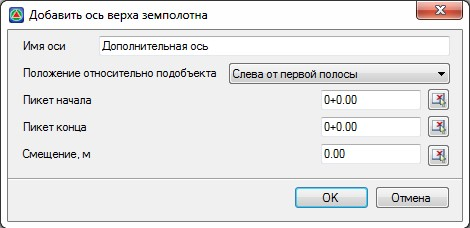

# Дополнительная ось

Данная функция предназначена для создания **Дополнительных осей**, которые описывают границы характерных элементов дороги, такие как кромки, бровки, различные зоны обочины и т.д. Данные элементы также могут использоваться для выбора их в качестве элементов сопряжений при проектировании закруглений на пересечениях.

Для создания элемента **Дополнительная ось**:

1. Выберите меню **Задачи - Пересечения - Создать элементы - Дополнительная ось**, откроется диалоговое окно:

   

   **Имя оси** - в данном поле введите название создаваемой оси.

   В селекторе **Положение относительно подобъекта** выберите элемент относительно которого будет строиться создаваемая **Дополнительная ось**.

   В соответствующих полях ввода задайте **Пикет начала** и **Пикет конца** дополнительной оси. Пикетажные значения могут быть выбраны визуально с помощью соответствующих кнопок  или заданы необходимые числовые значения.

   В поле **Смещение** имеется возможность дополнительно задать величину смещения относительно выбранного положения.

2. Введите необходимые параметры и нажмите **Ок**. В результате элемент ** Дополнительная ось** будет построен.



Все параметры созданного элемента можно поменять в окне **Свойства**, выделив элемент левой кнопкой мыши в окне **План**.

