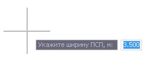

# Ось ПСП

Данная функция предназначена для создания **Дополнительных осей**, которые могут быть созданы в качестве вспомогательных элементов, например ось **ПСП**, и использоваться для выбора их как элементов сопряжений при проектировании закруглений на пересечениях.



Отличие данной функции от описанной выше, состоит только в способе ввода Дополнительной оси.



Для создания элемента **Ось ПСП**:

1. Выберите меню **Задачи - Пересечения - Создать элементы - Ось ПСП**, курсор примет форму прицела и будет перемещаться с привязкой от оси трассы.
2. Визуально укажите начало и конец создаваемой **Оси ПСП**.

   

   Сторонность создаваемого элемента относительно оси трассы будет определяться в зависимости от того с какой стороны было указано Начало дополнительной оси.

   

3. В динамической строке ввода задайте величину смещения:

   

   

   Данная величина будет отложена от крайней полосы проезжей части.

   

В результате будет создана **Дополнительная ось**.



Все параметры созданного элемента можно поменять в окне **Свойства**, выделив элемент левой кнопкой мыши в окне **План**.

