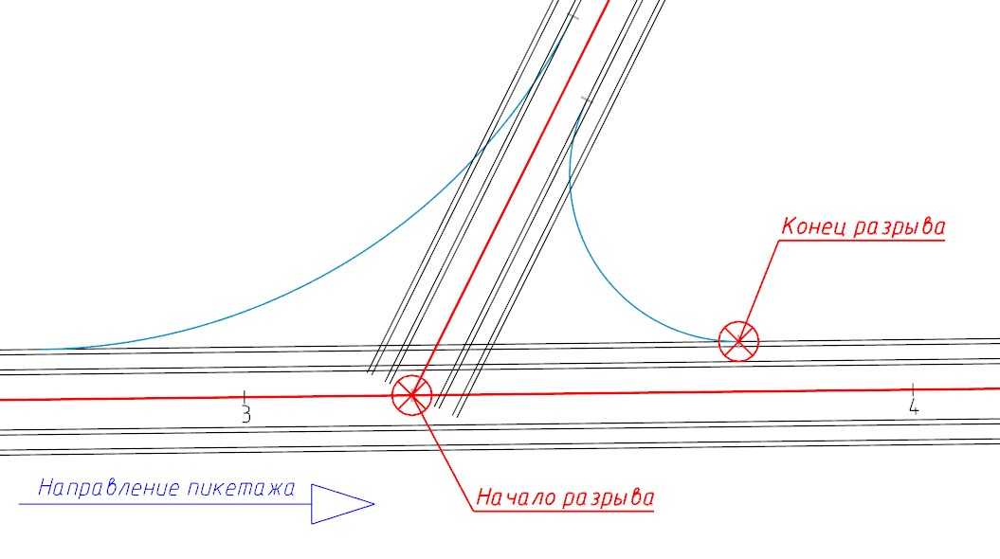
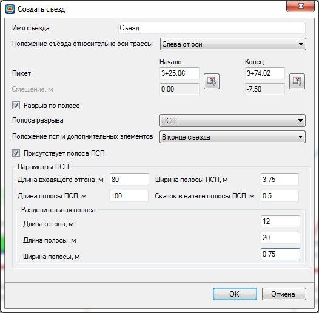
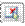
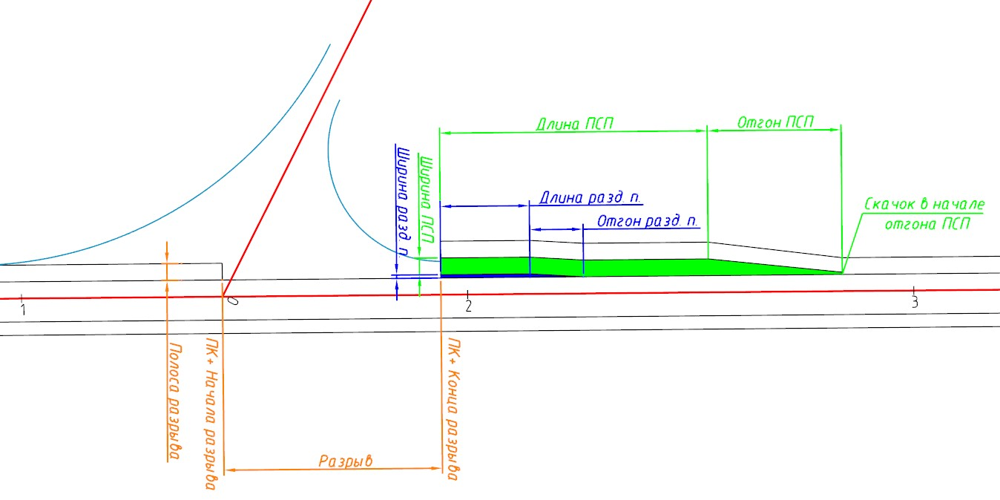
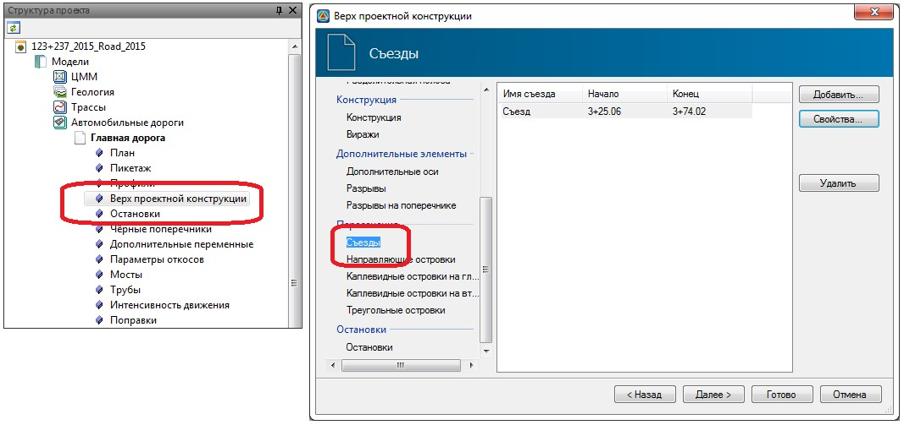

# ПСП с разрывом

Данная функция предназначена для создания элемента «**ПСП с разрывом**», который необходим для построения одноуровнего пересечения, в частности, создания переходно-скоростной полосы, разделительной полосы и разрыва.

Для создания данного элемента:

1. Выберите меню **Задачи - Пересечения - Создать элементы - ПСП с разрывом...**, курсор примет форму прицела и будет перемещаться с привязкой к подобъекту.
2. Визуально укажите начало и конец разрыва.

   

   В зависимости от направления пикетажа дороги на которой добавляется элемент, началом или концом разрыва будет являться, либо точка пересечения осей дорог, либо граница закругления пересечения:

   

   

3. В открывшемся окне установите необходимые параметры:

   

   **Имя съезда** - в данном поле введите название создаваемого элемента.

   **Положение съезда относительно оси трассы** - в данном выпадающем списке выберите сторонность съезда, слева или справа от оси трассы в зависимости от направления пикетажа.

   В поле **Пикетаж** задается пикет **Начала** и **Конца** создаваемого элемента. Пикетажные значения могут быть выбраны визуально с помощью соответствующих кнопок  или заданы необходимые числовые значения.

   Опция **Разрыв по полосе** позволяет выполнить построение пересечения относительно оси, кромки или любой другой полосы главной дороги, а также автоматически выполнить обрезку основных полос и обочин на данном участке, исключив в дальнейшем ручную доработку чертежа пересечения. В селекторе выберите полосу до которой будет сделан разрыв.

   В поле **Положение ПСП** и дополнительных элементов задается положение добавляемых элементов (**ПСП и Разделительная полоса**).

   Включение опции **Присутствует полоса ПСП** позволят создать элемент **ПСП** и **Разделительная полоса** с необходимыми параметрами.

4. Нажмите **Ок**. В результате будет создан элемент «**ПСП с разрывом**». Ниже на схеме представлен созданный элемент с подписью всех параметров элемента:



1. Все параметры созданного элемента можно поменять в окне Свойств, выделив элемент левой кнопкой мыши в окне План.
2. Созданные элементы хранятся в таблице Верх проектной конструкции (вкладка Съезды), которая находится в Структуре проекта в дереве таблиц текущего подобъекта Автомобильной дороги:

   

3. На приведенной схеме выше, был добавлен после пересечения (отсчет ведется от направления пикетажа главной дороги) один элемент «ПСП с разрывом», для корректного построения примыкания\ пересечения необходимо наличие двух или четырех элементов «ПСП с разрывом» соответственно.

