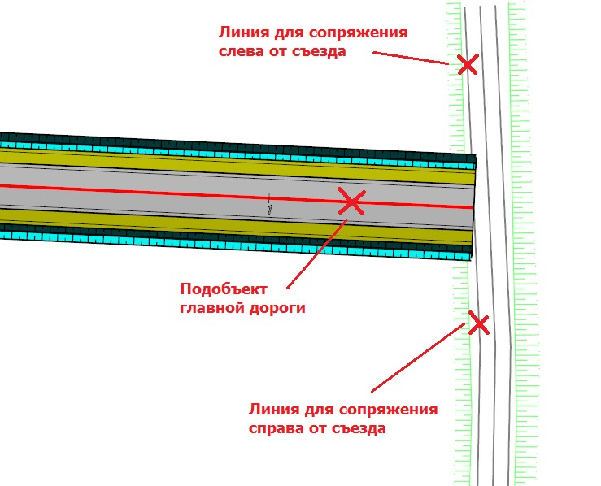
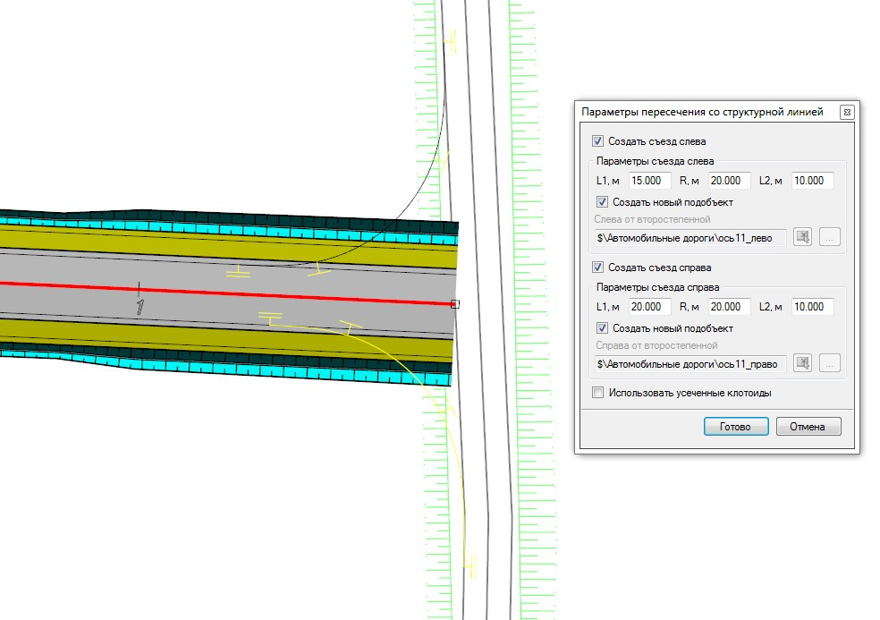
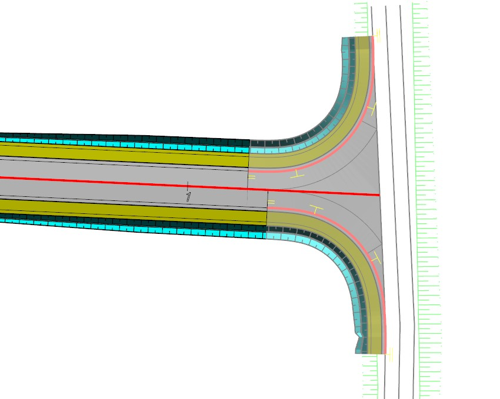

# Примыкание к структурной линии

Функция позволяет запроектировать примыкание между подобъектом автомобильная дороги и выбранной структурной линией. Данный функционал может быть применен в случае проектирования объектов генплана, когда к площадному притрассовому объекту, например, автозаправочной станции или площадке отдыха проектируется заезд или съезд с автомобильной дороги. Так же данный функционал может быть использован для проектирования примыкания к существующей дороге.

Для этого:

1. Выберите меню **Задачи – Пересечения – Утилиты – Построить примыкание по структурным линиям и подобъекту**, курсор примет форму прицела, укажите необходимые элементы для построения:

   

2. Откроется диалоговое окно с параметрами создания пересечения:

   

   

   Подробное описание задаваемых параметров имеется в [разделе Проектирование одноуровневых пересечений и примыканий](general_information.md)

   

3. Нажмите **Готово**. В результате будут созданы дополнительные подобъекты по кромкам закруглений, профили которых автоматически увязаны с главным подобъектом и структурными линиями, а также добавлены необходимые элементы пересечения на главном подобъекте:

   



Для удаления созданного пересечения необходимо самостоятельно удалить подобъекты по кромкам закруглений, а также раскрыв в Структуре проекта дерево таблиц текущего подобъекта в таблице Верх проектной конструкции очистить таблицу Разрывы. 

