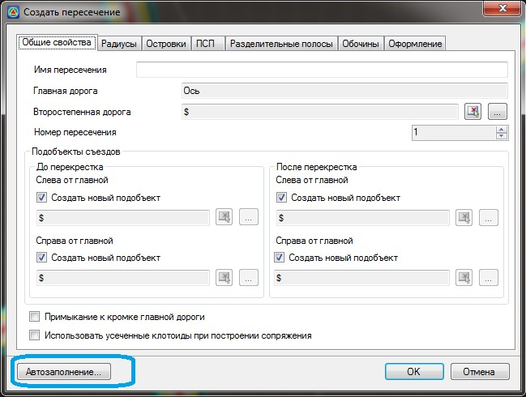
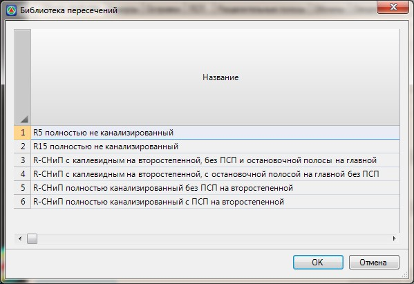

# Автозаполнение параметров пересечений

Процедура **Автозаполнения** позволяет автоматически определить параметры элементов пересечения или примыкания исходя из их типа и категорий пересекаемых дорог. **Автозаполение** доступно на любом этапе создания пересечения. Однако, необходимо помнить, что при нажатии кнопки **Автозаполнение** все параметры, занесенные вручную будут пересчитаны программой. Для того чтобы применить автозаполнение, нажмите соответствующую кнопку расположенную в нижней части окна создания пересечения:

Откроется диалоговое окно выбора типовой схемы пересечения:

Выберите типовую схему пересечения и нажмите кнопку **ОК**. Параметры пересечения будут рассчитаны в зависимости от выбранной типовой схемы и категорий пересекаемых дорог.



 Имеется возможность создавать собственные схемы пересечений и сохранять их в данную библиотеку как типовые. Последовательность действий по созданию собственных типовых схем пересечений будет описана ниже в соответствующем разделе.



Соответственно, после процедуры **Автозаполнения**, будут заполнены основные вкладки мастера создания пересечения. Такие как: **Радиусы, Островки, ПСП, Разделительные полосы, Обочины**. При необходимости данные в этих вкладках могут быть отредактированы.

Если основные параметры пересечения заданы и необходимо сделать его визуальную оценку, т.е. отрисовать его на плане, нажмите кнопку **ОК** расположенную в нижней части окна **Свойства** перекрестка.

В результате программа создаст пересечение, добавив характерные полосы и островки в главную и второстепенную дорогу, модифицирует поперечные профили на соответствующем участке и отрисует его в окне **План**:



Если взаимное расположение главной и второстепенной дороги не позволяет создать пересечение с заданными параметрами, к примеру: не хватает длины главной дороги чтобы добавить к ней переходно-скоростную полосу, то в этом случае программа выдаст соответствующие предупреждение. Все подобные сообщение отображаются в окне **Список ошибок**. Для открытия данного окна выберите элемент меню: **Вид – Список ошибок**.


