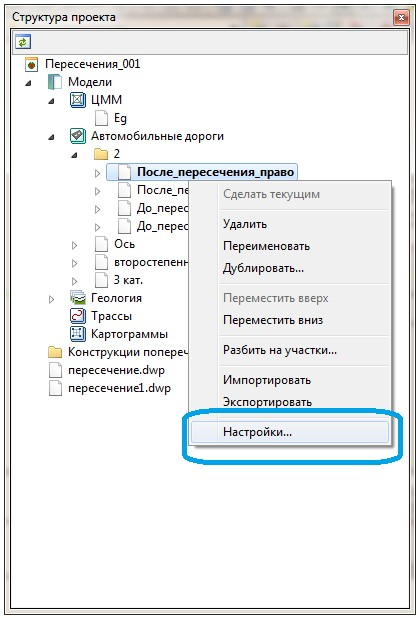
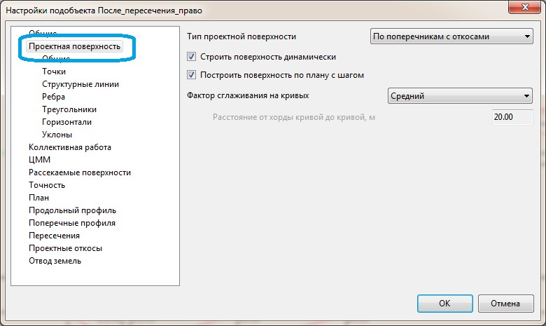
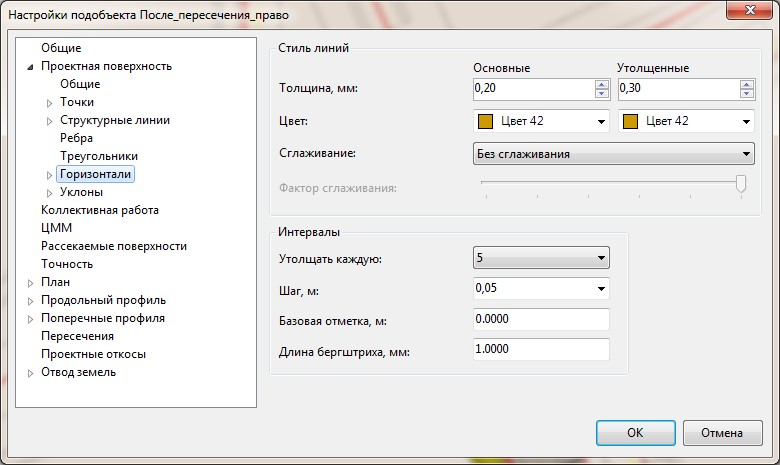

# Построение поверхности по пересечению и примыканию

При проектировании водоотвода на пересечениях и других площадных участках бывает удобно представлять проектное решение в горизонталях или уклоноуказателях.

Для того чтобы отобразить проектные горизонтали, по текущему пересечению/примыканию необходимо сформировать поверхность.

Для этого:

1. В окне **Структура проекта**, в папке хранящей подобъекты по кромкам съездов, щелкните правой кнопкой мыши по наименованию модели, для которой необходимо настроить отображение проектной поверхности. Из появившегося контекстного меню выберите пункт **Настройки**:

   

2. В открывшемся окне **Настроек подобъекта** перейдите на вкладку **Проектная поверхность**:

   

   Установите основные параметры построения проектной поверхности и нажмите **Ок**.

   

   Данные настройки были описаны ранее в разделе [Настройка подобъекта Автомобильная дорога](../../general_information/setting_subobject.md).

   

3. Настроим отображение основных элементов автоматически создаваемой поверхности по кромке съезда. Для этого разверните группу настроек с наименованием **Проектная поверхность** и задайте параметры отображения основных ее элементов. К примеру, для настройки отображения стиля сглаживания и шага отрисовки проектных горизонталей, используйте подгруппу настроек с соответствующим наименованием:

   .

   

   

   Для настройки видимости отображения основных элементов проектной поверхности, также может быть использован менеджер слоев текущей модели:

   

   

4. Аналогичную последовательность действий по созданию и настройке отображения проектной поверхности проделайте для остальных подобъектов участвующих в построении текущего пересечения.



Для задания параметров отображения\ представления по умолчанию для вновь создаваемых моделей подобъектов, выберите меню Сервис - Настройка.

