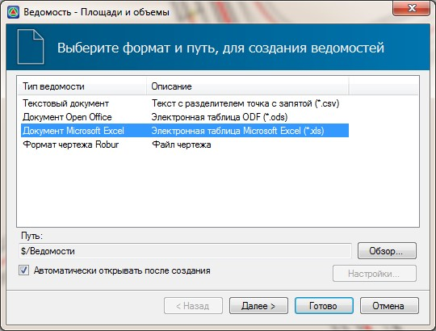
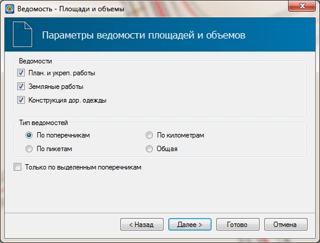
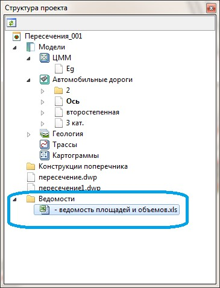

# Подсчет объемов работ

Подсчет объемов работ по пересечению или примыканию также как и по основной дороге происходит по поперечникам. Поперечники автоматически разбиваются по каждой кромке съезда по умолчанию с шагом близким к 1м. Суммарные данные по объемам на пересечении включены в общую ведомость объемов той дороги, на которой оно создавалось (главная дорога). Для формирования ведомости объемов работ с учетом пересечений:

1. Выберите элемент меню: **Проект - Создать ведомость - площадей и объемов**. Откроется мастер формирования ведомостей.
2. Выберите формат формируемой ведомости и нажмите **Далее**:

   

3. Задайте основные параметры формирования ведомости площадей и объемов и нажмите **Готово**:

   

В результате программа сформирует ведомость объемов и откроет ее в соответствующем редакторе. Объемы работ по всем пересечениям которые были созданы на текущей трассы будут расположены в нижней части ведомости:

