# Создание вертикальной планировки пересечения

Вертикальная планировка создается на этапе расчета пересечения или примыкания:

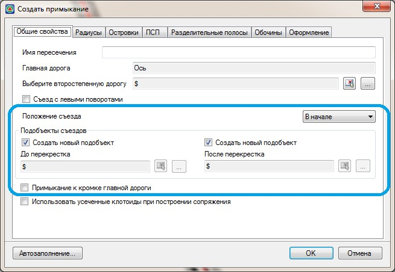

**Подобъекты съездов** – в данной группе полей задаются все основные параметры вспомогательных трасс, используемых для моделирования вертикальной планировки пересечения, его оформления, а также подсчета объемов основных работ по пересечению.

По умолчанию данная опция установлена и программа при формировании пересечения создаст эти подобъекты самостоятельно. При необходимости, можно предварительно создать группу моделей с собственными наименованиями и выбрать их в качестве подобъектов съездов. Для этого снимите опцию **Создать новый подобъект**, а далее с помощью кнопки  
выберите модель из списка или укажите ее визуально в окне **План**, с помощью кнопки .



 Подобъекты съездов необходимы для создания пересечения. В случае если при создании пересечения опция Создать подобъект снята и в соответствующем поле ничего не выбрано, то будет выдано предупреждение:

 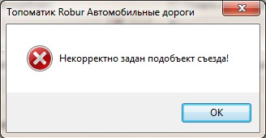



**Примыкание к кромке главной дороги** - вариант определения отметок контрольных точек при построении профиля по кромки съезда. А также, данная опция влияет на то, какие объемы работ будут включены в главную дорогу, а какие выделены в само пересечение.

* Если данная опция не установлена, то границами пересечения на второстепенной дороге будут являться концы кривых, а на главной дороге ось трассы:

  

  На выше приведенной схеме заштрихована зона, объемы которой будут включены в пересечение, она же является областью проектирования поверхностного водоотвода.

* Если данная опция установлена, то линия границы пересечения с главной дорогой будет проходить по ее кромке:

  

  На выше приведенной схеме заштрихована зона, объемы которой будут включены в пересечение, она же является областью проектирования поверхностного водоотвода. В этом случае продольные и поперечные уклоны в пределах проезжей части главной дороги остаются неизменными.

Для моделирования вертикальной планировки пересечения по каждой кромке съезда создается вспомогательная трасса. Их количество зависит от типа пересечения, т.е. четыре подобъекта будут созданы на пересечении и два на примыкании:

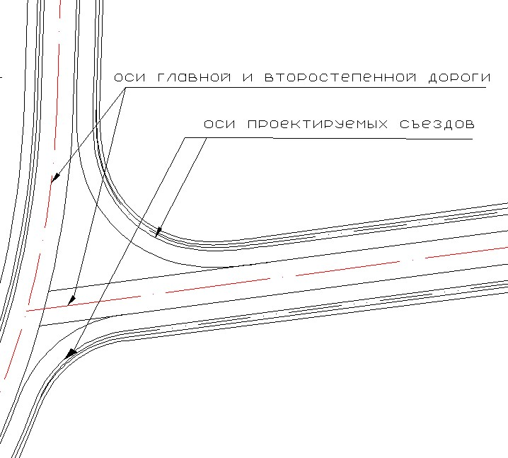

Данные подобъекты сохраняются в отдельную папку, которая отображается в окне **Структура проекта**, ее наименование совпадает с именем созданного пересечения. Соответственно при удалении пересечения данная папка с трассами также будет автоматически удалена:

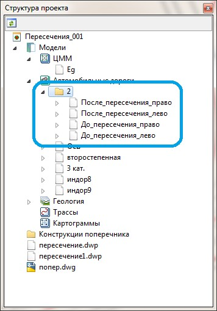

Каждый из этих подобъектов уже при создании содержит первое приближение проектного профиля с учетом примыкания к фиксированным точкам кромок главной и второстепенной дороги. На данном этапе каждому подобъекту съезда также автоматически присваивается верх проектной конструкции поперечного профиля. С рассчитанными уклонами полос проезжей части и обочин:

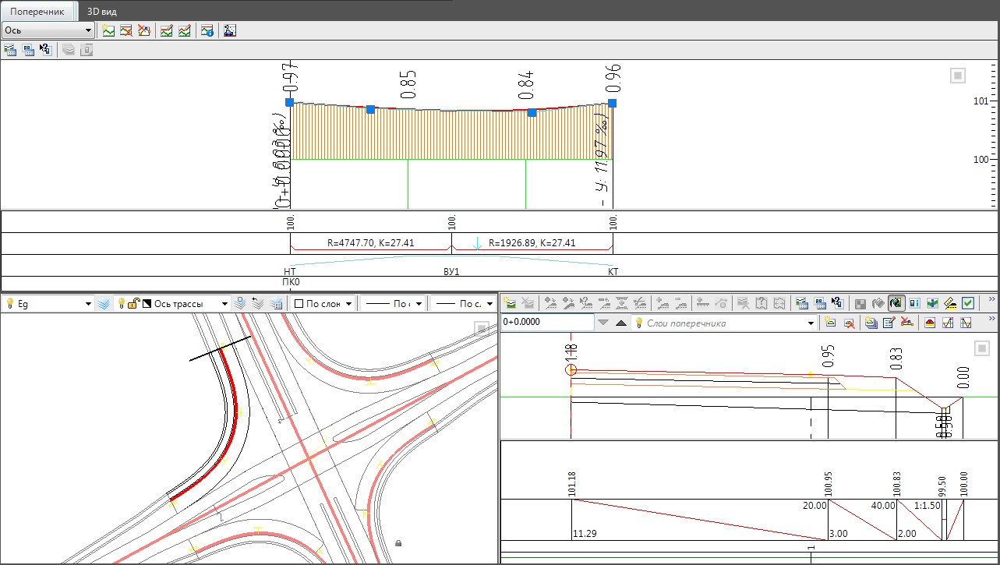

Основной процесс редактирования вертикальной планировки пересечения, состоит в редактировании первого приближения продольных и поперечных профилей, по каждому съеду.

Принципиально, технология проектирования профиля по кромке съезда на пересечении ничем не отличается от проектирования профиля по оси трассы. Более подробно информация о работе с продольным профилем была описана в разделе [Продольный профиль](../../road_profile/general_provisions.md).

Для того чтобы, отредактировать профиль по съезду:

1. Сделайте соответствующий подобъект текущим.
2. Откройте окно **Профиль**:

   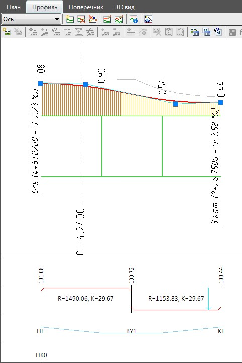

В окне профиль должен быть отображен профиль по кромке текущего съезда, причем начало и конец красной линии по умолчанию совпадают с фиксированными точками и уклонами проектных кромок главной и второстепенной дороги, на границах пересечения. Для того чтобы при проектировании продольного профиля по съезду видеть как проходит основной профиль (профиль по оси дороги), он автоматически сохраняется в таблице **Дополнительный профиль** структуры проекта и отображается на экране в виде отдельной линии.

При этом часть данных для построения этой линии берется с продольного профиля оси второстепенной дороги, а часть с профиля оси главной дороги, либо кромки главной дороги, в зависимости от используемой схемы расчета пересечения. Т.е., условно можно считать, что для проектирования вертикальной планировки и определения уклонов проезжей части в пределах пересечения используются два профиля: профиль по границе текущей части пересечения (он в процессе работы должен оставаться неизменным) и профиль по кромке съезда:

#|
||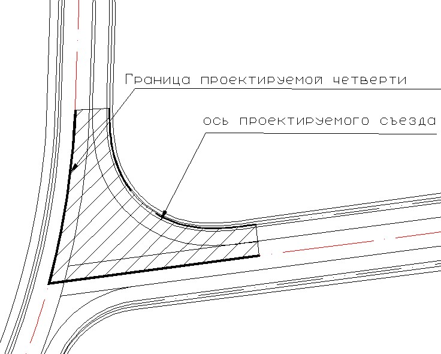|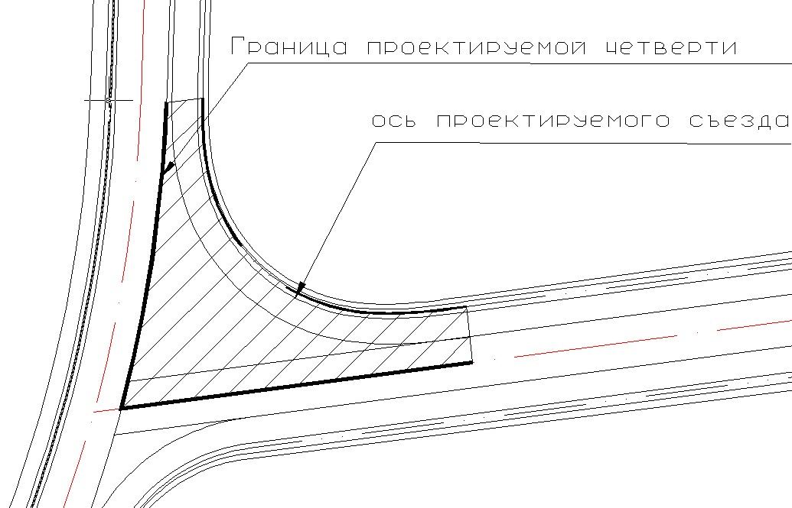||
||Тип примыкания - К оси главной дороги|Тип примыкания - К кромке главной дороги||
|#

Как было сказана выше, по умолчанию линия профиля по границе проектируемой части пересечения сохраняется в структуре проекта, в таблицах вспомогательных продольных профилей, либо в профиле 1-й левый или 1-й правый:

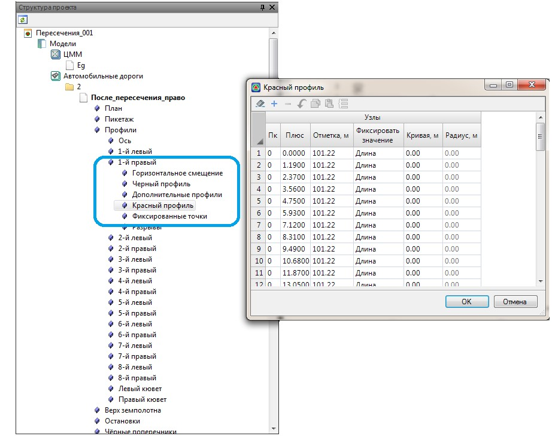

Для того чтобы отобразить эту линию в окне проектирования профиля по кромке съезда, воспользуйтесь функцией **Профиль сослаться на профиль**. В качестве ссылочного профиля выберите 1-й левый или 1-й правый соответственно:

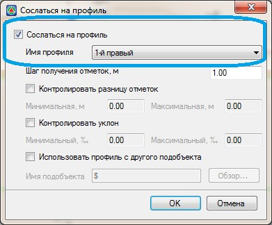

Для того чтобы посмотреть поперечный профиль по проектируемой части пересечения или примыкания:

1. Сделайте текущим соответствующий подобъект.
2. Воспользуйтесь элементом меню **Поперечник - Показать окно**:

   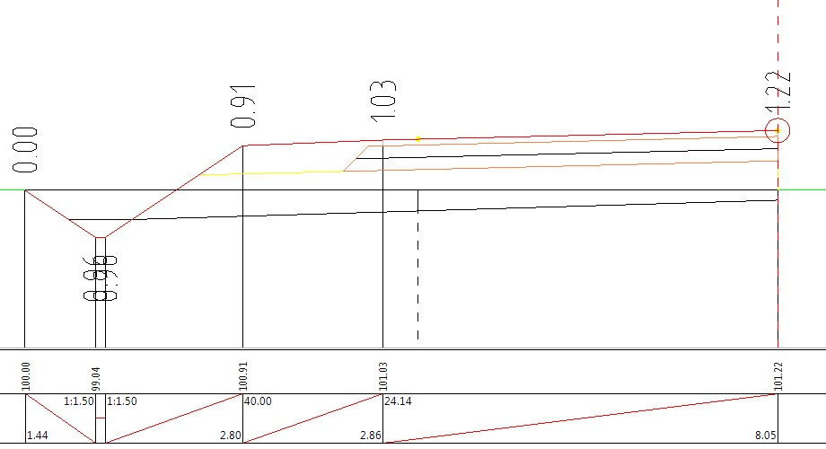

   

   1. Отображаемая часть поперечного профиля также зависит от расчетной схемы формирования пересечения или примыкания (до кромок или до оси главной дороги).
   2. По умолчанию на пересечении используются шаблоны Пересечение слева от главной и Пересечение справа от главной и отличающиеся друг от друга только направлением.
   3. Возможно также использование индивидуальных пользовательских шаблонов. Процедура подключения пользовательских шаблонов конструкций поперечных профилей была описана ранее в разделе [Проектирование поперечников с использованием шаблонов конструкций](../../road_crossection/total/designing_cross_profiles_using_templates.md)

   

Для того чтобы отредактировать параметры верха конструкции текущей части пересечения, без его полного пересчета, воспользуйтесь элементом меню: **Поперечник - Задать параметры конструкции**. Откроется окно мастера:

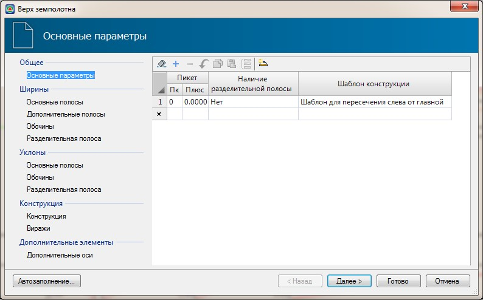

Часть таблиц данного мастера не заполнены и не влияют на процесс редактирования поперечного профиля. К примеру, уклоны полос проезжей части в пределах пересечения между кромкой съезда и осью второстепенной дороги вычисляются автоматически между соответствующими профилями.

Более подробно процесс создания и редактирования верха конструкции с помощью данного мастера был описан ранее в разделе [Проектирование поперечников с использованием шаблонов конструкций](../../road_crossection/total/designing_cross_profiles_using_templates.md).

Для подсчета объемов работ и формирования выходных чертежей, помимо верха конструкции по каждой съезду с пересечения также должны быть запроектированы откосы и кюветы. Поперечные профили по кромкам съездов с пересечения создаются с маленьким шагом (по умолчанию около 1м.).

Последовательность проектирования этих элементов описана ранее в разделах [Проектирование откосов](../../road_crossection/total/designing_slopes.md) и [Проектирование кюветов](../../road_crossection/total/designing_ditches.md).