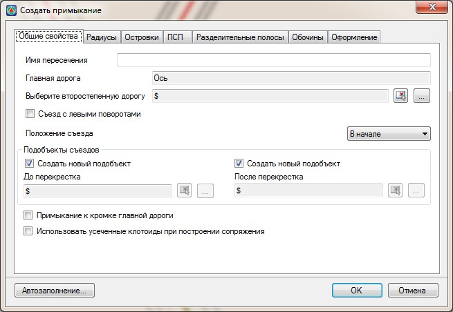

# Создание примыканий

Под примыканием понимается пересечение Т-образного типа. Процедура их создания и редактирования аналогична стандартным пересечениям, которая была описана выше.

Для того, чтобы создать примыкание необходимо выполнить следующие действия:

1. Выберите пункт меню **Задачи - Пересечения - Создать примыкание**. Курсор примет форму прицела, укажите левой кнопкой мыши ось той дороги, которая при построении пересечения будет являться главной. Откроется диалоговое окно:

   

На вкладке **Общие свойства** введите следующие параметры:

**Имя пересечения** – в данном поле введите наименование создаваемого примыкания. Оно быть уникальным, т.е текущая трасса на которой будет создаваться примыкание не должна содержать другие пересечения или примыкания с аналогичным названием.

**Выберите главную дорогу** - в данном поле должно быть задано наименование второстепенной дороги. Для этого, нажмите в этом поле кнопку  откроется список моделей типа **Автомобильная дорога**, которые содержит текущий проект. Выберите из списка наименование модели дороги, которая для данного пересечения будет являться второстепенной и нажмите **ОК**.

Также, второстепенную дорогу можно выбрать визуально. Для этого в данном поле нажмите кнопку  , курсор примет форму прицела, левой кнопкой мыши укажите в графическом поле окна **План** ось дороги, которая для данного пересечения должна являться второстепенной.

**Съезд с левыми поворотами** – данная опция используется при расчете примыканий, с возможностью левого поворота с второстепенной дороги на главную. Эта опция будет автоматически сброшена, если при использовании процедуры автозаполнения выбрана типовая схема примыкания без левых поворотов.

**Положение съезда** - данный параметр задается в том случае если второстепенная дорога примыкает к главной дороге в своей начальной и конечной точке (по пикетажу) и необходимо уточнить, на каком именно участке будет формироваться пересечение.

**Подобъекты съездов** – в данной группе полей задаются все основные параметры вспомогательных трасс, используемых для моделирования вертикальной планировки примыкания, его оформления, а также подсчета объемов основных работ по примыканию. Настройки создания подобъектов съездов были описаны ранее в разделе **Создание пересечений**.

**Использовать усеченные клотоиды при построении сопряжения** – по умолчанию при сопряжении кромок главной и второстепенной дороги круговой кривой с переходными кривыми, используются полные клотоиды, кривизна которых меняется от бесконечности до заданного радиуса. Если данная опция установлена, и граница кривой сопрягающей кромки главной и второстепенной дороги будет находиться не на прямолинейном участке, то в этом случае при сопряжении будут использоваться усеченные клотоиды.