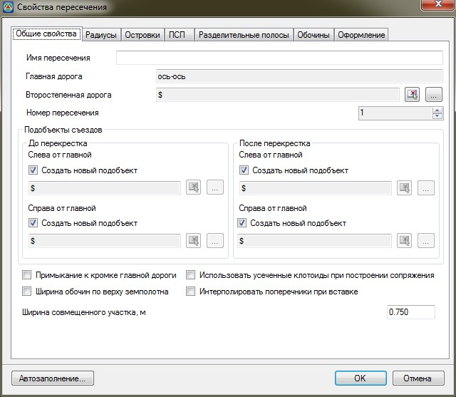
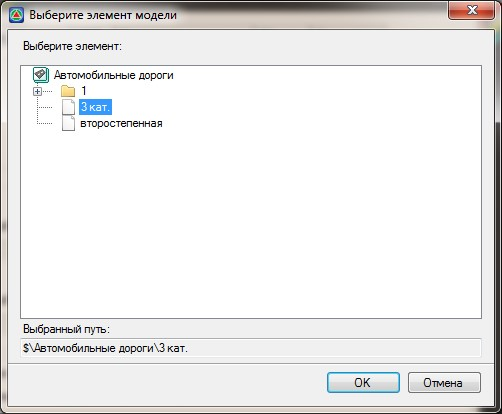

# Создание пересечений

Для того, чтобы создать пересечение необходимо выполнить следующие действия:

1. Выберите пункт меню **Задачи - Пересечения - Создать пересечение**. Курсор примет форму прицела, укажите левой кнопкой мыши ось той дороги, которая при построении пересечения будет являться главной. Откроется диалоговое окно:

   

Все параметры пересечения сгруппированы по соответствующим вкладкам, которые расположены в верхней части данного окна.

На вкладке **Основные параметры** введите следующие параметры:

**Имя пересечения** – в данном поле введите наименование создаваемого пересечения. Имя пересечения должно быть уникальным, т.е. текущая трасса, на которой будет создаваться пересечение не должна содержать другие пересечения или примыкания с аналогичным названием.

**Выберите второстепенную дорогу** - в данном поле должно быть задано наименование второстепенной дороги. Для этого, нажмите в этом поле кнопку  откроется список моделей типа **Автомобильные дорога**, которые содержит текущий проект:

Выберите из списка наименование модели дороги, которая для данного пересечения будет являться второстепенной и нажмите **ОК**.

Также, второстепенную дорогу можно выбрать визуально. Для этого в данном поле нажмите кнопку , курсор примет форму прицела, левой кнопкой мыши укажите в графическом поле окна **План** ось дороги, которая для данного пересечения должна являться второстепенной.

**Номер пересечения** - данный параметр задается в том случае если главная и второстепенная дорога пересекаются несколько раз и необходимо уточнить, на какой именно точке будет формироваться пересечение. Нумерация пересечений идет по направлению пикетажа главной дороги.

**Подобъекты съездов** – в данной группе полей задаются все основные параметры вспомогательных трасс, используемых для моделирования вертикальной планировки пересечения или примыкания, его оформления, а также подсчета объемов основных работ по ним. Более подробно процедура работы с данными подобъектами будет описана далее в разделе **Вертикальная планировка пересечения**.

По умолчанию опция **Создать новый подобъект** установлена и программа при формировании пересечения создаст эти подобъекты самостоятельно. При необходимости, можно предварительно создать группу моделей с собственными наименованиями и выбрать их в качестве подобъектов съездов. Для этого снимите опцию **Создать новый подобъект**, а далее с помощью кнопки  выберите модель из списка или укажите ее визуально в окне **План**, с помощью кнопки 



 Подобъекты съездов необходимы для создания пересечения или примыкания. В случае если при их создании опция **Создать подобъект** снята и в соответствующем поле ничего не выбрано, то будет выдано предупреждение:

 



**Строить профили съездов по кромке главной дороги** - вариант определения отметок контрольных точек при построении профиля по кромки съезда. Более подробно эта процедура будет описана далее в разделе [Вертикальная планировка пересечения](create_vertical_layout_crossing.md).

**Использовать усеченные клотоиды при построении сопряжения** – по умолчанию при сопряжении кромок главной и второстепенной дороги круговой кривой с переходными кривыми, используются полные клотоиды, кривизна которых меняется от бесконечности до заданного радиуса. Если же данная опция установлена, и граница кривой сопрягающей кромки главной и второстепенной дороги будет находиться не на прямолинейном участке, то в этом случае при сопряжении будут использоваться усеченные клотоиды.

Включение опции **Ширина обочины по верху земполотна** позволяет игнорировать параметры ширин обочин, которые заданы в окне **Свойств** пересечений на вкладке **Обочины**, и принять ширины обочин те, которые заданы в таблице **Верх проектной конструкции**, в соответствующей таблице.

Включение опции **Интерполировать поперечники при вставке** позволяет автоматически запроектировать откосы на тех поперечниках, которые будут добавлены при создании пересечения в характерных местах, например по границам сопряжения кромок. Параметры откосов всегда определяются интерполяцией между откосами существующих поперечников.

Опция **Ширина совмещенного участка** определяет длину участка подобъекта по кромке закругления, на котором поперечные уклоны по четверти пересечения будут равны поперечным уклонам основной дороги. Длина участка совмещения определяется по заданному в соответствующем поле максимальному расхождению оси примыкания от кромки главной дороги.

Схема ниже:



 Данная опция используется в случае когда примыкание\ пересечение проектируется к кромке главной дороги. В этом случае опция позволяет более корректно запроектировать примыкающий к кромке главной дороги участок продольного профиля подобъектов закруглений. Описание механизмов проектирования вертикальной планировки пересечений\ примыканий см. [ниже](create_vertical_layout_crossing.md) в соответствующей главе.

