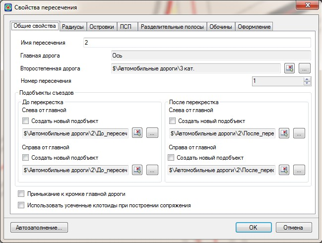
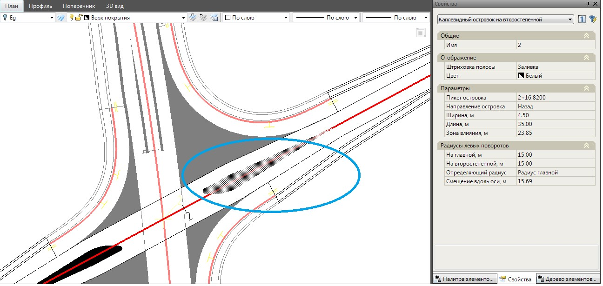
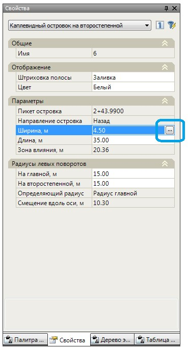
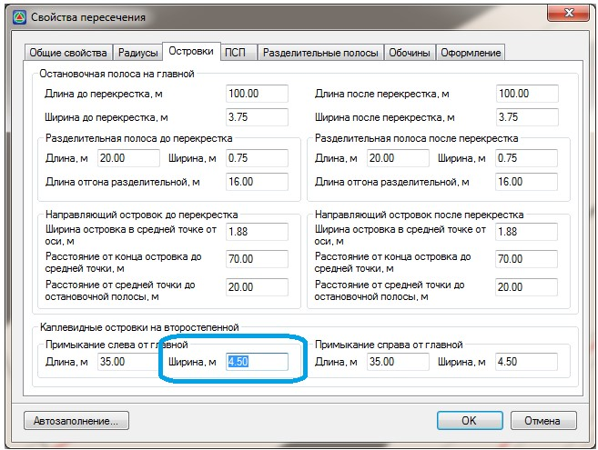
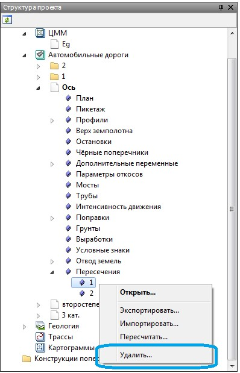
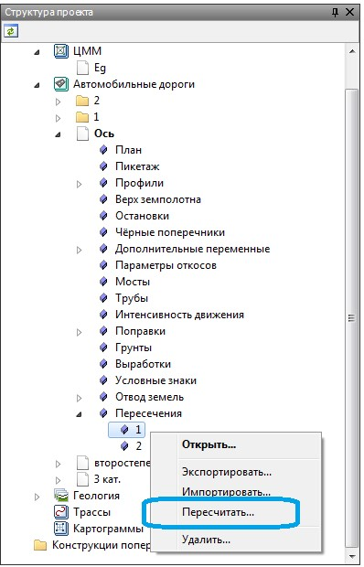

# Редактирование пересечений и примыканий

* Для того чтобы изменить параметры уже созданного пересечения/примыкания и перестроить его:

  1. Сделайте текущим подобъект, который содержит данное пересечение. При создании пересечения все его параметры сохраняются в модели дороги, которая была выбрана как **Главная**.
  2. В окне **Структура проекта**, раскройте дерево таблиц текущего подобъекта. Все созданные пересечения находятся в списке с соответствующим названием. Щелкните дважды левой кнопкой мыши по пересечению, которое необходимо отредактировать. Откроется стандартное окно **Свойства пересечения**.

     

  3. Измените необходимые параметры пересечения и нажмите **ОК**. В результате, текущее пересечение будет перестроено с учетом внесенных изменений.

* Для получения информации о параметрах созданного пересечения достаточно выделить соответствующий его элемент на плане, данные по выбранному элементу отобразятся в стандартном окне **Свойства**:

  

* Для изменения параметров выбранного элемента в окне **Свойств** нажмите соответствующую кнопку:

  

  В результате на соответствующей вкладке откроется окно **Свойств** пересечения, а поле в котором задается значение будет выделено:

  

  Измените значение и нажмите **Ок**.

* Для того чтобы удалить пересечение/примыкание:

  1. Сделайте текущим подобъект, который содержит данное пересечение.
  2. В окне **Структура проекта**, раскройте дерево таблиц текущего подобъекта. Все созданные пересечения находятся в списке с соответствующим названием. Щелкните правой кнопкой мыши по пересечению, которое необходимо удалить. Из появившегося контекстного меню выберите пункт **Удалить**:

     

В результате выбранное пересечение будет удалено, а главная и второстепенная дорога, которые образовывали данное пересечение, будут перестроены.

* При изменении положения главной или второстепенной дороги необходимо пересчитать пересечения/ примыкания которые строились на их основе. Для того чтобы пересчитать одно определенное пересечение/ примыкание:

  1. Cделайте текущим подобъект, который содержит данное пересечение.
  2. В окне **Структура проекта**, раскройте дерево таблиц текущего подобъекта. Все созданные пересечения находятся в списке с соответствующим названием. Щелкните правой кнопкой мыши по пересечению, которое необходимо пересчитать. Из появившегося контекстного меню выберите пункт **Пересчитать:**

     

В результате выбранное пересечение будет пересчитано с учетом изменений параметров главной или второстепенной дороги.



Если необходимо одновременно пересчитать все пересечения, которые содержит текущая трасса, воспользуйтесь элементом меню: **Задачи – Пересечения – Перестроить пересечения**.

