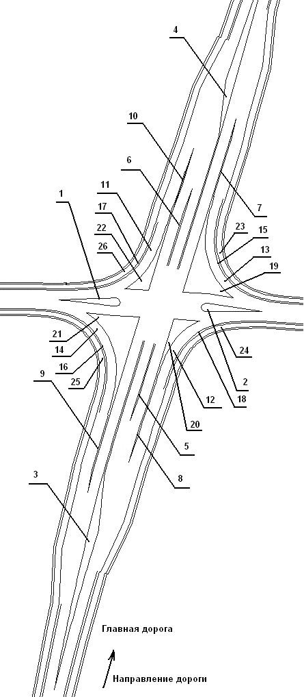

# Элементы пересечений и примыканий

Основные создаваемые программой элементы пересечений представлены ниже на рисунке, под соответствующими номерами:

1. - Каплевидный островок на второстепенной дороге слева от главной дороги.
2. - Каплевидный островок на второстепенной дороге справа от главной дороги.
3. - Направляющий островок между основными полосами до пересечения.
4. - Направляющий островок между основными полосами после пересечения.
5. - Разделительная полоса между основной и полосой накопления до пересечения.
6. - Разделительная полоса между основной и полосой накопления после пересечения.
7. - Разделительная полоса между основной полосой и ПСП, справа от главной дороги, после пересечения.
8. - Разделительная полоса между основной полосой и ПСП, справа от главной дороги, до пересечения.
9. - Разделительная полоса между основной полосой и ПСП, слева от главной дороги, до пересечения.
10. - Разделительная полоса между основной полосой и ПСП, слева от главной дороги, после пересечения.
11. - ПСП слева от главной дороги, после перекрестка.
12. - ПСП справа от главной дороги, до перекрестка.
13. - ПСП справа от главной дороги, после перекрестка.
14. - ПСП слева от главной дороги, до перекрестка.
15. - Радиус съезда справа от главной дороги, после перекрестка.
16. - Радиус съезда слева от главной дороги, до перекрестка.
17. - Радиус съезда слева от главной дороги, после перекрестка.
18. - Радиус съезда справа от главной дороги, до перекрестка.
19. - Треугольный островок справа от главной дороги, после перекрестка.
20. - Треугольный островок справа от главной дороги, до перекрестка.
21. - Треугольный островок слева от главной дороги, до перекрестка.
22. - Треугольный островок слева от главной дороги, после перекрестка.
23. - Обочина после перекрестка справа.
24. - Обочина до перекрестка справа.
25. - Обочина до перекрестка слева.
26. - Обочина после перекрестка слева



Примыкание (оно же Т-образное пересечение), по сути, содержит тот же набор элементов что и пересечение указанное выше и строится по аналогичным принципам. Большая часть функционала будет описана далее на примере пересечения, однако следует иметь ввиду, что он также применим и для проектирования примыканий.

