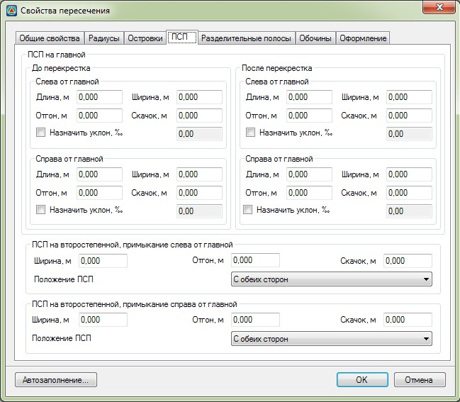
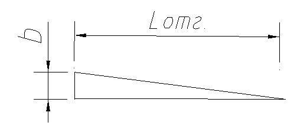

# Переходно-скоростные полосы

На вкладке **ПСП** задаются следующие параметры:

* **ПСП на главной дороге слева и справа, до и после перекрестка** – для каждой **ПСП** задается ширина, длина основной части и отгона. На схеме они подписаны как b, L, Lотг. соответственно:

  

  Включение опции **Назначить уклон** позволяет в соответствующем поле ввода задать уклон **ПСП** на пересечении. Если опция выключена, то уклон **ПСП** принимается по уклону крайней основной полосы.

* **ПСП на второстепенной дороге, слева и справа от главной** - для каждой **ПСП** задается ширина и длина отгона. На схеме они подписаны как **b** и **Lотг**. соответственно:

  

В соответствующих селекторах задается положение **ПСП**.