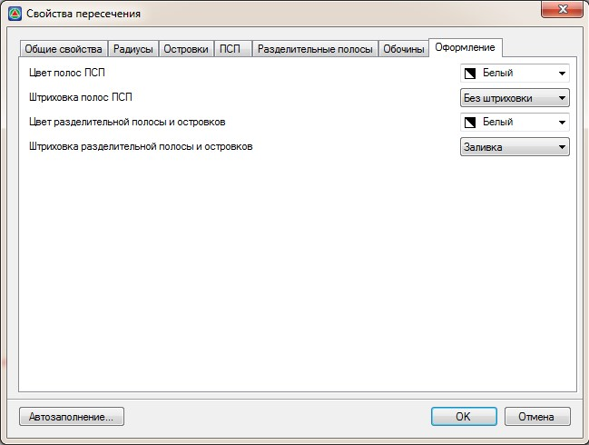

# Оформление

На данной вкладке можно задать определенные правила оформления элементов пересечения:

**Цвет полос ПСП** - из выпадающего списка выбирается цвет которым необходимо отрисовать границы ПСП.

**Штриховка полос ПСП** – из выпадающего списка выбирается цвет заливки, которой будут заполнены контуры полос ПСП.

**Цвет разделительной полосы и островков** - из выпадающего списка выбирается цвет которым необходимо отрисовать границы разделительных полос и направляющих островков.

**Штриховка разделительной полосы и островков** – из выпадающего списка выбирается цвет заливки, которой будут заполнены контуры разделительных полос и направляющих островков.