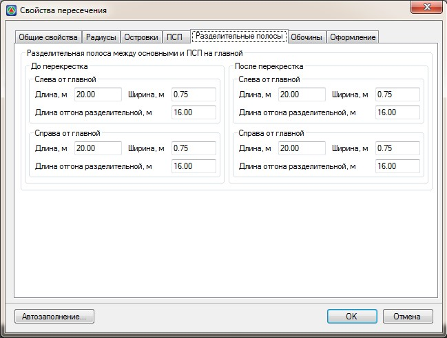

# Разделительные полосы

На вкладке **Разделительные полосы** задаются следующие параметры:

* **Разделительные полосы слева и справа от главной, до и после перекрестка**- задается ширина, длина основной части и отгон разделительных полос между ПСП и основными полосами проезжей части. На схеме они подписаны как b, Lpазд.пол., L, соответственно:

  