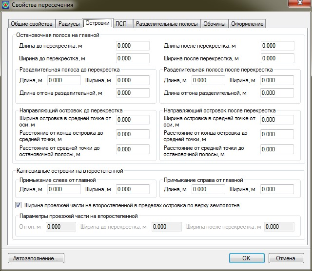
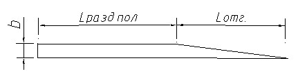
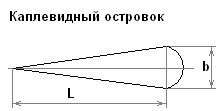

# Островки

На вкладке **Островки** задаются следующие параметры:

* **Остановочная полоса на главной дороге, до и после перекрестка** - задается значение длины и ширины накопительной полосы. На схеме они подписаны как **L** и **b** соответственно.

  

* **Разделительная полоса, до и после перекрестка** - задается ширина, длина основной части и отгона разделительной полосы между остановочной и основной полосой проезжей части. На схеме они подписаны как **b**, **Lразд.пол.** и **Lотг**. соответственно.

  

* **Направляющий островок, до и после перекрестка** – задаются следующие параметры: ширина островка в средней точке от оси, расстояние от конца островка до средней точки, расстояние от средней точки до остановочной полосы. На схеме они подписаны как **b**, **L1**, **L2** соответственно.

  

* **Каплевидные островки слева и справа от главной дороги** – задается длина и ширина каплевидного островка. На схеме они подписаны как **R1, R2, R3, R4** соответственно.

  

Если опция **Ширина проезжей части на второстепенной в пределах островка по верху земполотна** выключена, то в соответствующих полях ввода задается **Ширина** и **Отгон** уширения проезжей части до каплевидного или треугольного островка. Если же данная опция включена, то все геометрические параметры на данном участке будут приниматься из соответствующих таблиц **Ширин**, которые заданы в стандартном мастере для примыкающей дороги (окно **Верх проектной конструкции**).

