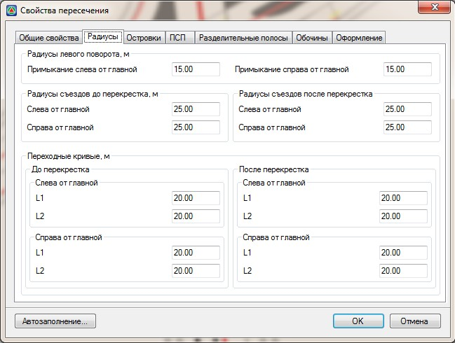

# Радиусы

На вкладке **Радиусы** задаются следующие параметры:

* **Радиус левого поворота, примыкание слева от главной** - задается соответствущая величина радиуса, на схеме данный параметр подписан как Rl1.
* **Радиус левого поворота, примыкание справа от главной** - задается соответствущая величина радиуса, на схеме данный параметр подписан как Rl2.

  

* **Радиусы съездов До перекрестка слева и справа и После перекрестка слева и справа от главной дороги** - задается радиуса для каждого съезда, на схеме они подписаны как R1, R2, R3, R4 соответственно.
* **Длины переходных кривых До перекрестка слева и справа и После перекрестка слева и справа от главной дороги** – задается значение длины входящей и исходящей переходной кривой, на схеме они подписаны как L1, L2, L3, L4, L5, L6, L7, L8 соответственно.

  