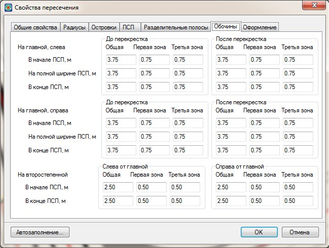
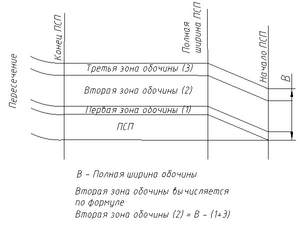
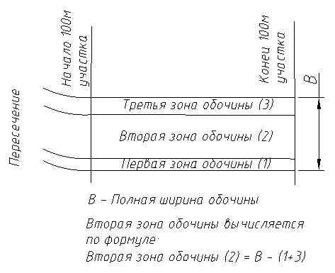

# Обочины

На вкладке **Обочины** задаются следующие параметры:

**Обочина на главной дороге слева и справа, до и после перекрестка** - задается ширина обочины в начале ПСП, на участке ее полной ширины, а также в конце ПСП. При отсутствии ПСП эти ширины обочин (ширина вначале ПСП и ширина в конце ПСП) применяются на главной дороге, на участке протяженностью 100м, до и после пересечения. В каждом характерном сечении задается полная ширина обочины, а также ширина ее первой и третьей зоны. Ширина второй зоны обочины вычисляется по остаточному принципу. Если в данных сечениях задана различная ширина обочины, то на промежуточных участках она будет определяться линейной интерполяцией.

#|
|||||
||**Схема 1** - Обочина при наличии ПСП.|**Схема 2**- Сокращенные обочины без ПСП.||
|#

**Обочина на второстепенной дороге слева и справа от главной** - задается ширина обочины в начале и в конце ПСП. В остальном правила задания параметров обочины как при наличии ПСП так и при ее отсутствии аналогичны описанным выше, для главной дороги.



В случае если установлена опция **Ширина обочин по верху земполотна**, то данные параметры на вкладке Обочины являются нередактируемыми.

