# Создание съезда

На данном этапе происходит создание основных элементов узла примыкания съезда развязки к основному ходу. Для создания съезда:

1. Выберите элемент меню **Задачи - Пересечения - Создать - Съезд**.

2. Курсор примет прицела, укажите левой кнопкой мыши ось основной дороги, к которой примыкает создаваемый съезд. Откроется следующие окно:

   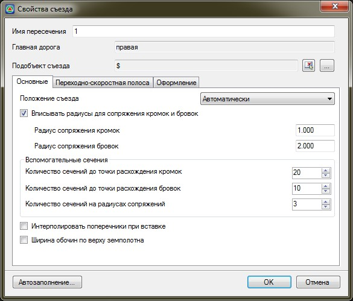

* На вкладке **Основные** задаются следующие параметры:

  **Имя пересечения** - наименование создаваемого съезда. Оно должно быть индивидуальным, т.е. основная дорога, в пределах которой будут создаваться данный съезд, не должна иметь пересечений с идентичными названиями.

  **Подобъект съезда** - в данном поле должно быть задано наименование модели съезда транспортной развязки. Для этого, нажмите в этом поле кнопку  откроется список моделей типа Автомобильные дорога, которые содержит текущий проект:

  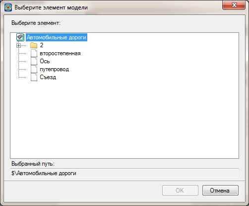

  Выберите из списка требуемую модель и нажмите **ОК**.

  Также, съезд развязки можно выбрать визуально. Для этого в данном поле нажмите кнопку  , курсор примет форму прицела, левой кнопкой мыши укажите в графическом поле окна **План** соответствующую ось дороги.

  **Радиус сопряжения кромок и бровок** - в соответствующих полях могут быть заданы значения радиусов сопрягающих кривых для кромок и бровок основной дороги и съезда с развязки. На схеме ниже они обозначены как R1 и R2:

  

  В группе полей **Вспомогательные сечения** задается количество дополнительных поперечных профилей, которые будут добавлены в модель основной дороги и съезда развязки, для более корректного и точного построения проектной поверхности на съезде. Количество дополнительных сечений задаются: от начала совмещенного участка до точки расхождения кромок, на участке между точками расхождений кромок и бровок, а также на участках сопряжения кромок и бровок основной дороги и съезда с развязки. Эти характерные участки схематично показаны ниже:

  

  

  В данной группе полей лишь задается необходимое количество дополнительных поперечников. Однако, они не будут добавлены автоматически на этапе создания съезда. Для вставки дополнительных поперечников воспользуйтесь функцией: Поперечник - Вставить поперечники по верху земляного полотна.

  

  Включение опции **Ширина обочины по верху земполотна** позволяет игнорировать параметры ширин обочин, которые заданы в окне Свойств съезда на вкладке Переходноскоростная полоса, и принять ширины обочин те, которые заданы в таблице Верх проектной конструкции, в соответствующей таблице.

  Включение опции **Интерполировать поперечники при вставке** позволяет автоматически запроектировать откосы на тех поперечниках, которые будут добавлены при создании пересечения в характерных местах, например по границам сопряжения кромок. Параметры откосов всегда определяются интерполяцией между откосами существующих поперечников.

* На вкладке **Переходно - скоростная полоса** задаются следующие параметры:

  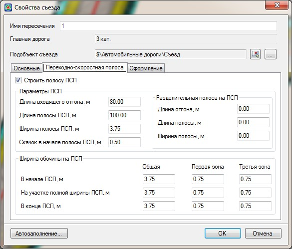

  **Строить полосу ПСП** - установите данную опцию если съезд развязки совмещается с переходно-скоростной полосой. В этом случае в соответствующих полях необходимо задать параметры ПСП, параметры разделительной полосы между ПСП и полосами основной дороги, а также ширину обочины в пределах ПСП. Схематично данные параметры показаны ниже:

  #|
  ||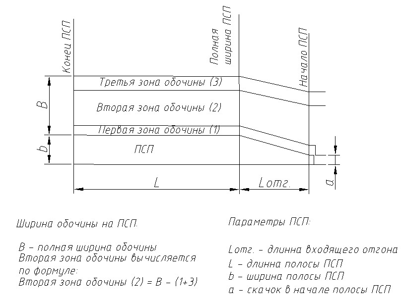|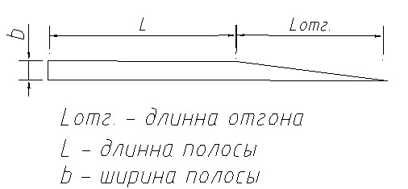||
  ||Схема 1. Параметры ПСП и обочины на ПСП|Схема 2. Параметры разделительной полосы между ПСП и полосами основной дороги||
  |# {wide-content}

  Если же, слияние основной дороги и съезда развязки происходит без устройства переходноскоростной полосы, то данную опцию необходимо снять. В этом случае все вышеуказанные параметры будут недоступны для задания.

  **Автозаполнение** – при нажатии данной кнопки открывается библиотека типовых съездов:

  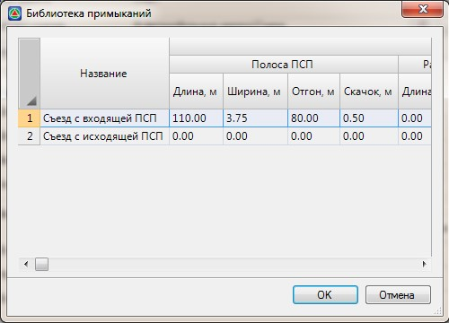

  При выборе какого-либо съезда из списка и нажатии кнопки **ОК**, его параметрами будут автоматически заполнены поля вкладки Переходно-скоростная полоса.

  

  Библиотека съездов может редактироваться и дополняться. Для задания в данной библиотеке дополнительных типовых съездов:

  1. Воспользуйтесь элементом меню Задачи - Пересечения - Библиотека - Библиотека съездов. Откроется тоже окно, которое будет доступно для редактирования.
  2. Отредактируйте параметры имеющихся в списке съездов или добавьте новые записи.
  3. Для выхода из режима редактирования библиотеки нажмите ОК.

  

* На вкладе **Оформление** задаются следующие параметры:

  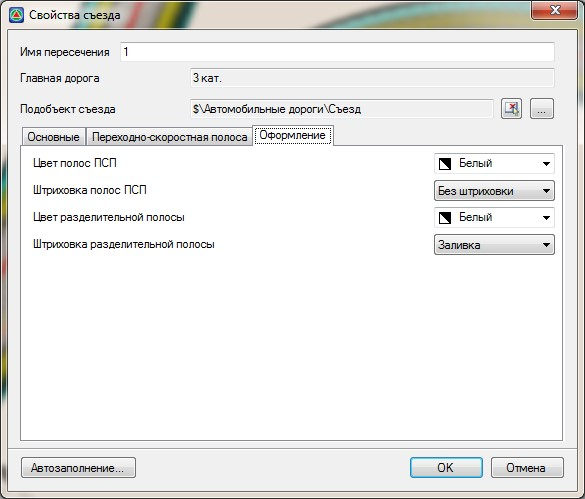

  **Цвет полос ПСП** - из выпадающего списка выбирается цвет, которым будут отрисованы границы переходно-скоростных полос.

  **Штриховка полос ПСП** - из выпадающего списка выбирается заливки, которой будут закрашены переходно-скоростные полосы.

  **Цвет разделительной полосы** - из выпадающего списка выбирается цвет, которым будут отрисованы границы разделительных полос между ПСП и проезжей частью основной дороги.

  **Штриховка разделительной полосы** - из выпадающего списка выбирается заливки, которой будут закрашены разделительные полосы между ПСП и проезжей частью основной дороги.

3. После задания всех основных параметров съезда нажмите **Ок**.

В результате съезд будет создан и отрисован в окне **План**.



1. После создания съезда длина совмещенного участка с основным ходом может измениться и в этом случае продольный профиль на данном узле необходимо уточнить. Для автоматизированного определения нового положения контрольных точек воспользуйтесь функцией **Задачи - Пересечения - Утилиты - Создать профиль по съезду и укажите новые границы совмещенного участка**.
2. Т.к. отдельные элементы узла съезда, к примеру: переходно-скоростная полоса, по умолчанию включаются в основной ход, то при изменении профиля по съезду развязки, соответствующий узел должен быть пересчитан.



Для этого:

* а. В окне **Структура проекта** разверните дерево таблиц той модели, в которой был создан узел пересечения, т.е. у подобъекта основного хода.
* б. Все узлы съездов находятся в группе с наименованием **Пересечения**. Щелкните правой кнопкой мыши по соответствующему узлу и выберите из появившегося контекстного меню пункт **Пересчитать**:

  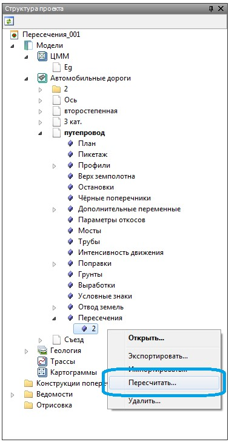

Для визуальной оценки корректности увязки съезда развязки с основным ходом, необходимо чтобы по каждой модели было настроено отображение проектной поверхности. Для этого:

1. Сделайте текущей модель, для которой необходимо включить автоматическое построение/ перестроение проектной поверхности.
2. В окне **Структура проекта** щелкните правой кнопкой мыши по наименованию модели, для которой необходимо настроить отображение проектной поверхности. Из появившегося контекстного меню выберите пункт **Настройки**:

   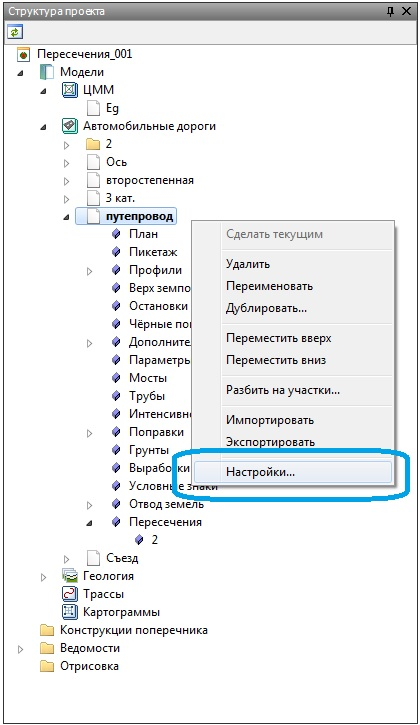

3. Перейдите на вкладку **Проектная поверхность**:

   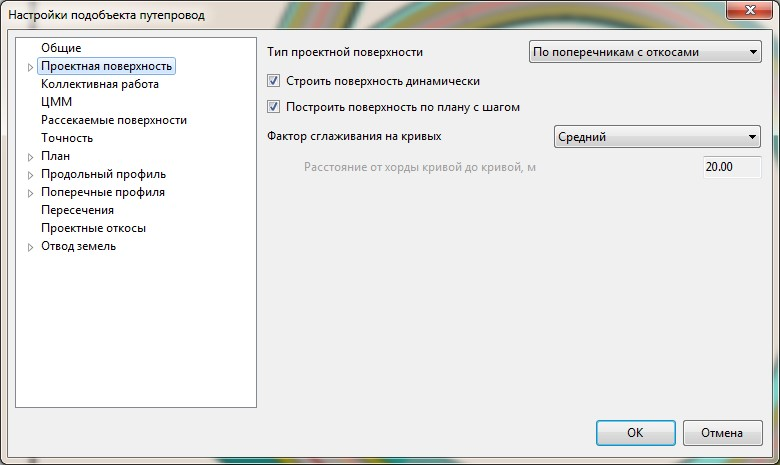

4. Настроим отображение основных элементов автоматически создаваемой проектной поверхности. Для этого щелкните правой кнопкой мыши по наименованию модели, для которой необходимо настроить отображение. Из появившегося контекстного меню выберите пункт **Настройка**.
5. В окне **Общие настройки подобъектов** разверните группу настроек с наименованием **Проектная поверхность** и задайте параметры отображения основных ее элементов. К примеру, для настройки отображения стиля сглаживания и шага отрисовки проектных горизонталей, используйте подгруппу настроек с соответствующим наименованием:

   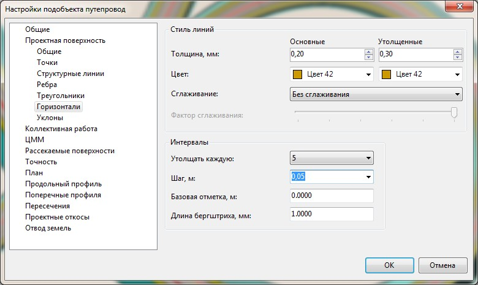

6. Задайте основные настройки отображения проектной поверхности и нажмите **ОК**.
7. При необходимости проделайте данную процедуру для других подобъектов проектируемой развязки.

В результате поверхности по соответствующим подобъектам будут отображены в окне **План**. Для обеспечения увязки поверхностей по высоте, достаточно проконтролировать совпадение их проектных горизонталей в данном окне:

Также для наглядного визуального контроля стыковки поверхностей основного хода и съезда транспортной развязки воспользуйтесь окном **3D-вид**:

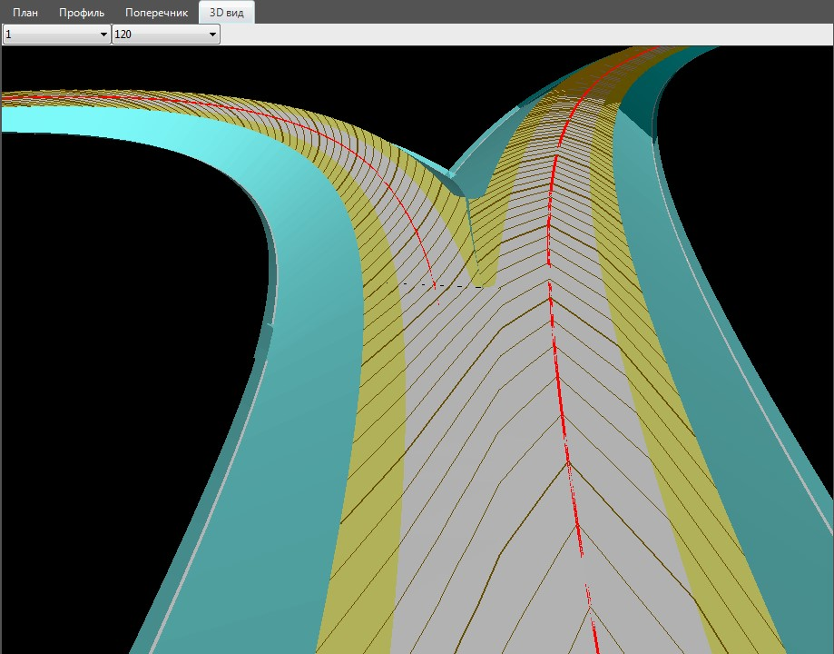



Для навигации в окне 3D-вида используются клавиши: W - движение вперед; S - движение назад; A - движение влево; D - движение вправо; Shift - движение вверх; Ctrl - движение вниз.

