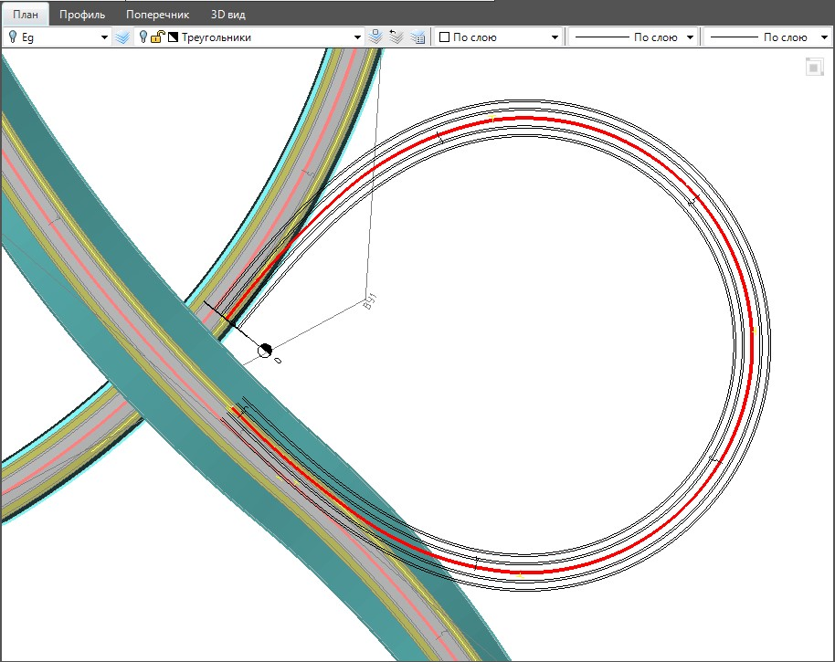

# Создание верха проектной конструкции по съезду

Для выполнения высотной увязки съезда развязки с основным ходом по нему предварительно должен быть создан верх проектной конструкции. Т.е. заданы ширины и уклоны таких полос как: проезжая часть, обочины, виражи и т.п.

Последовательность действий по заданию данных параметров была описана ранее в разделе [Проектирование поперечников с использованием шаблонов конструкций](../../road_crossection/total/designing_cross_profiles_using_templates.md).

В результате, после задания данных параметров, в окне **План** помимо оси съезда развязки будут отображены границы соответствующих полос:

