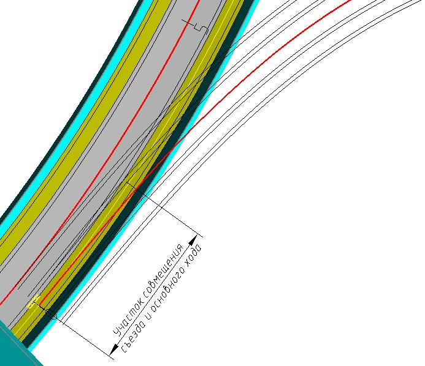
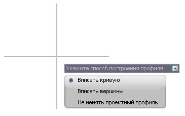
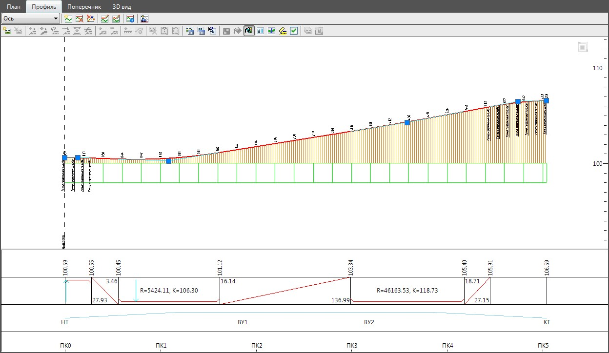

# Создание профиля съезда

Для проектирования профиля по съезду развязки может быть использован стандартный набор функций редактирования проектного профиля. В данном случае, наиболее трудоемкой процедурой является увязка начального и конечного участка профиля съезда развязки с основной дорогой. Т.к. на участке определенной протяженности у них должны быть увязаны отметки и уклоны:

Программа позволяет автоматически рассчитать на совмещенных участках съезда положение контрольных точек, через которые должен пройти продольный профиль и создать его первое приближение. Для этого необходимо задать визуально границу совмещенного участка, как правило, это точка расхождения кромок основной дороги и съезда развязки. Программа рассчитывает отметки контрольных точек, опираясь на известные поперечные уклоны в каждом сечении:

В качестве примера рассмотрим процедуру автоматизированного построения профиля с определением контрольных отметок на совмещенных участках в начале и в конце съезда развязки.

Для этого:

  1. Воспользуйтесь элементом меню: **Задачи - Пересечения - Утилиты - Построить профиль по съезду**.
  2. Укажите в строке динамического ввода количество контрольных точек, которые будут рассчитаны в пределах совмещенного участка.
  3. Курсор примет форму прицела, последовательно левой кнопкой мыши укажите ось основной дороги, а затем ось съезда с развязки.
  4. Укажите левой кнопкой мыши начало совмещенного участка. В большинстве случаев это начальная точка оси съезда развязки.
  5. Укажите левой кнопкой мыши конец совмещенного участка, в большинстве случаев это точка расхождения кромок основной дороги и съезда развязки.
  6. Программа выдаст следующий запрос:

     

     * В случае если выбрана опция **Вписать кривую**, то в этом случае программа при создании продольного профиля определит какой элемент и с какими параметрами необходимо применить чтобы пройти с минимальным отклонением от контрольных точек.
     * Выберите опцию ** Вписать вершины**, если необходимо чтобы линия проектного профиля прошла строго через контрольные точки. В этом случае она в пределах совмещенного участка может иметь большое количество переломов, число которых будет равно числу контрольных точек.
     * Выберите опцию **Не менять проектный профиль** в случае если изменений данного участка продольного профиля не требуется.
      
  7. Если профиль съезда имеет еще один совмещенный участок, например в конце, то еще раз проделайте п.2-п.6. Если же необходимо выйти из текущей команды и получить на профиле набор контрольных точек по указанному участку, щелкните правой кнопкой мыши.

В результате, программа вынесет на профиль соответствующие контрольные точки и проведет через них линию проектного профиля:

Для проектирования проектной линии вне совмещенных участков может быть использован весь стандартный функционал редактирования продольного профиля. Более подробно он был описан ранее в главе [Продольный профиль](../../road_profile/general_provisions.md).
