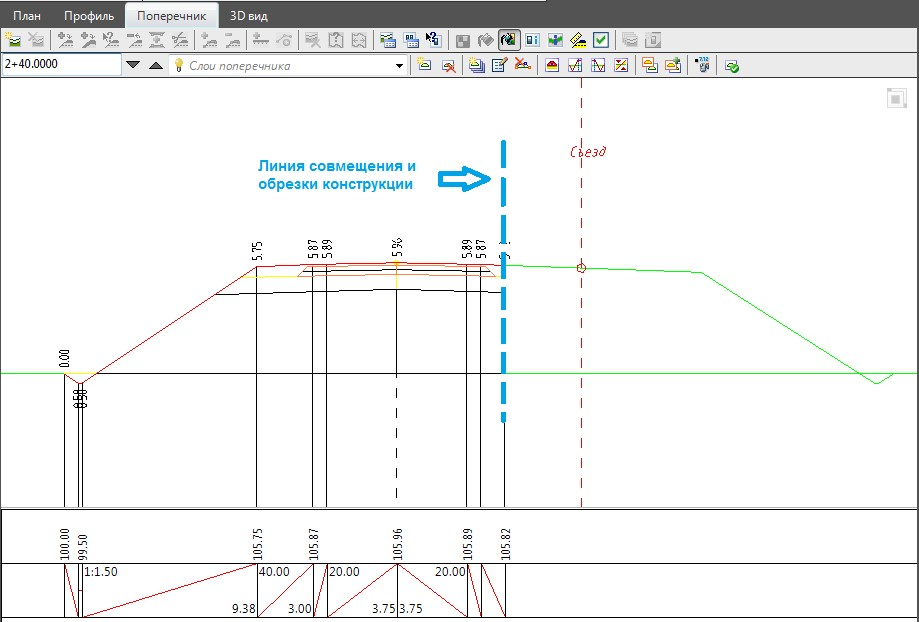
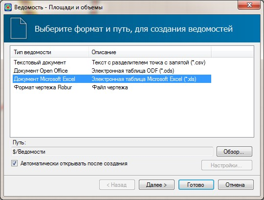
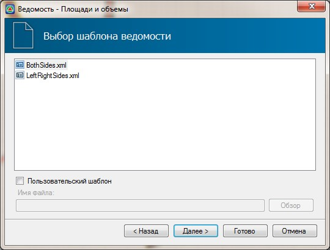
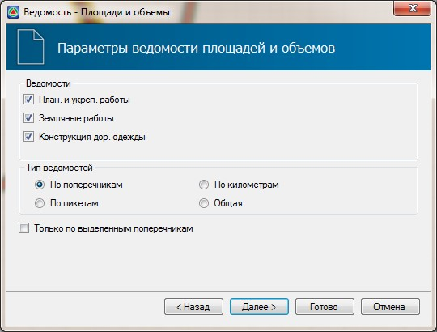

# Формирование ведомости объемов работ

Подсчет объемов работ происходит последовательно, по каждому съезду развязки, а также основным направлениям. Необходимо помнить что, при создании узла съезда происходит модификация поперечных профилей основного хода, за счет добавления дополнительных элементов, таких как ПСП, разделительные островки и т.п. Также, происходит обрезка части проектных поперечников основного хода по линии совмещения со съездом развязки:

Для формирования ведомости объемов работ с учетом съездов:

1. Сделайте текущим соответствующий подобъект.
2. Выберите элемент меню: **Проект - Создать ведомость - площадей и объемов**. Откроется мастер формирования ведомостей.

   

3. Выберите формат формируемой ведомости и нажмите **Далее**:

   

4. Задайте основные параметры формирования ведомости площадей и объемов и нажмите **Готово**:

   

В результате программа сформирует ведомость объемов и откроет ее в соответствующем редакторе.

Для формирования различных разбивочных ведомостей по съездам развязки:

1. Cделайте соответствующий съезд текущим.
2. Воспользуйтесь меню **Проект-Создать ведомость…**,и выберите необходимый тип ведомости.

Процедура формирования основных чертежей, таких как: ситуационный план, продольные и поперечные профили, была описана ранее в разделе [Чертежи и ведомости](../../../doc/index.yaml).
