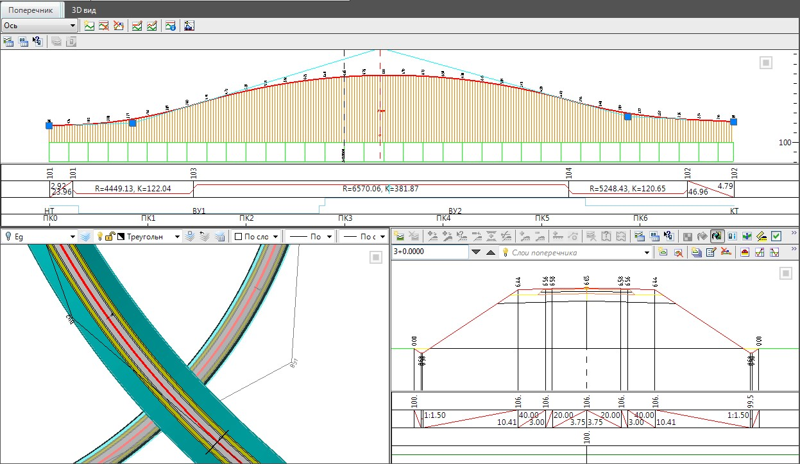

# Исходные данные и последовательность проектирования многоуровневого пересечения

Как уже было сказано ранее, развязка представляет собой набор моделей, каждый съезд развязки - это отдельный подобъект, имеющий собственные план, профиль и поперечники. В отличии от съезда развязки, под обычным съездом будем подразумевать узловой участок где происходит слияния съезда развязки с основным ходом. Соответственно, основной задачей проектирования многоуровневого пересечения является проектирование планово-высотной геометрии съездов развязки с увязкой их с основными дорогами и другими съездами в точках примыкания.

В качестве исходных данных необходимых для проектирования съезда, как правило, используются модели дорог основных ходов. Для решения задач планово - высотной увязки съезда достаточно чтобы по исходным дорогам был предварительно создан верх проектной конструкции, т.е. были заданы ширины и уклоны полос (проезжая часть, обочины, разделительные полосы).

Для получения полноценной, объемной модели развязки с возможностью подсчета основных объемов работ, каждая исходная дорога должна иметь полностью запроектированные конструкции поперечных профилей, включающих в себя: слои дорожной одежды, откосы, водоотводы, участки мостовых конструкций и т.п.
