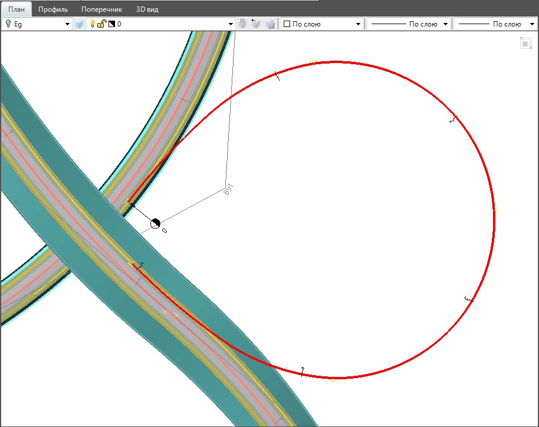

# Плановые построения

Для создания оси проектируемого съезда развязки может быть использован полный набор функций по работе с трассой, который был описан ранее.

Наиболее удобным для проектирования осей съездов является функционал по плановым построениям (меню: **Рисовать - Построения**).

Он позволяет автоматизировать выполнение геометрического сопряжения элементов используемых при проектировании соединительных кривых право - и левоповоротных рамп практически любого очертания. При этом:

* Сопрягаться могут как отдельные примитивы, так и комплексные линии, состоящие из множества сопряженных отрезков, дуг и клотоид. В последнем случае программа автоматически определяет, на какой из элементов попадает точка сопряжения.
* Выполняется автоматический подбор первого приближения.
* Имеется возможность визуально (при помощи мыши) редактировать параметры сопряжения.
* Если сопрягаются окружности или арки, то могут автоматически применяться усеченные клотоиды.

Данный блок функций был подробно описан ранее, см описание документации по работе с трассой, раздел [Редактор Сопряжений](../../../rb_survey/alg/plan_track/redactor_conjugation/appointment_redactor_conjugation.md).

После того как ось съезда будет отрисована примитивами из нее необходимо будет создать полноценную трассу. Для этого воспользуйтесь элементом меню: **План - Создать ось из примитивов**. Данная функция также была описана ранее в документации Работа с трассой раздел [План трассы](../../../rb_survey/alg/plan_track/plan_track.md).

В результате, на данном этапе будет создана ось съезда развязки сопряженная с соответствующими полосами дорог, к которым он примыкает:

