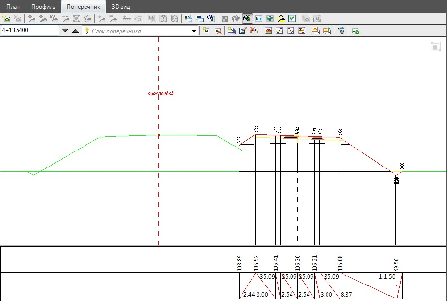
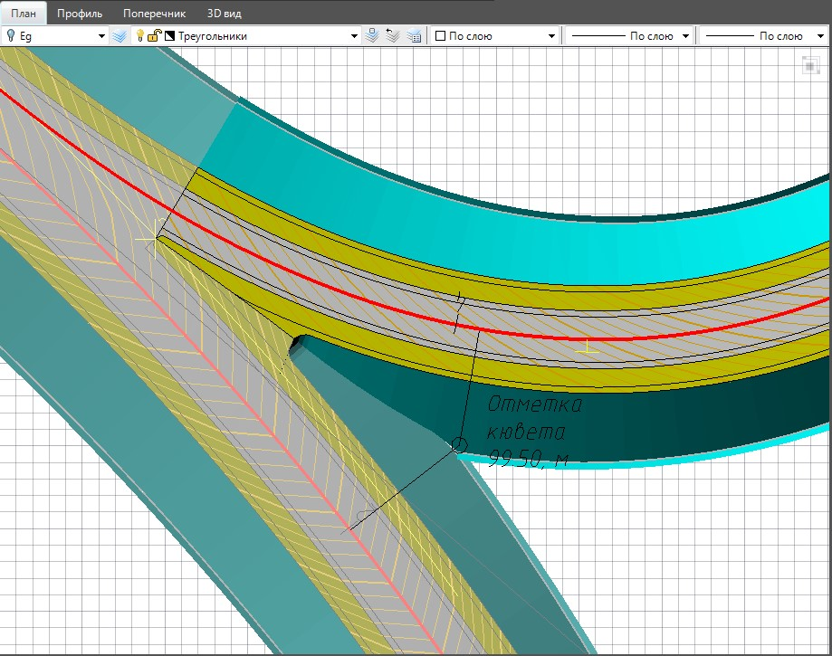
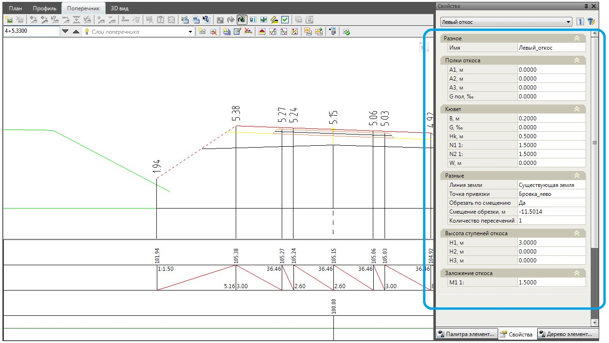
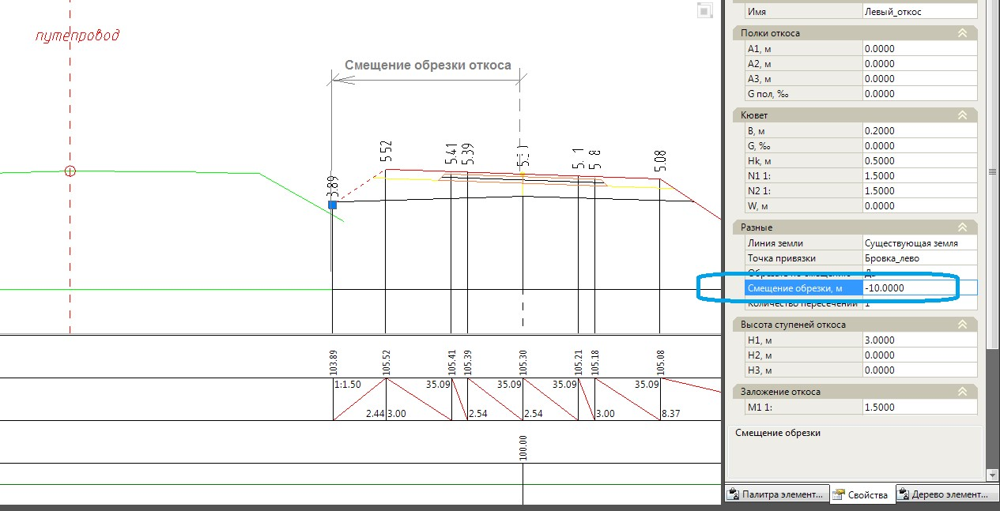

# Проектирование поперечных профилей по съезду развязки

Окончательное проектирование поперечных профилей, по основному ходу и съезду развязки включает в себя этапы создания или редактирования откосов и водоотводов. Данные задачи были подробно описаны ранее в главе **Поперечные профили**.

Автоматизирована трудоемкая процедура взаимной увязки откосов и кюветов съезда с основным ходом. Программа позволяет определить точку расхождения их откосов или кюветов (при их наличии), в дальнейшем будем называть ее точкой расхождения откосов: На участке между точкой расхождения бровок и откосов, программа выполняет автоматическую обрезку откосов основной дороги и съезда по линии их совмещения:

Если на данном совмещенном участке по съезду развязки был создан кювет, то его отметки дна автоматически выравниваются по отметкам кювета основной дороги. После расхождения откосов, кюветы могут проектироваться независимо друг от друга.

Для того чтобы воспользоваться данной функцией:

1. Выберите элемент меню **Задачи - Пересечения - Утилиты - Построить расхождение откосов для съезда**.
2. Курсор примет форму прицела, последовательно левой кнопкой мыши укажите в окне План ось основной дороги и ось съезда.
3. Левой кнопкой мыши графически укажите в окне **План** точку расхождения кромок и бровок на узле съезда.
4. В строке динамического ввода укажите количество дополнительных поперечников, которые будут добавлены в модель основной дороги и съезда развязки для более корректного построения проектной поверхности на участке между точками расхождения бровок и откосов.
5. Для подтверждения действия щелкните правой кнопкой мыши.

В результате, программа определит местоположение точки расхождения откосов и увяжет откосы и кюветы съезда с основной дорогой.

В результате увязки откосов, программа определяет линию их пересечения и обрезает по ней откосы основной дороги и съезда развязки:

Если, по какой либо причине обрезка откоса происходит не корректно, имеется возможность самостоятельного задания положения контура обрезки на поперечниках. Как уже говорилось ранее, параметры предварительно созданных откосов могут быть изменены через стандартное окно свойств выбранного объекта. Для этого, на поперечнике левой кнопкой мыши выберите откос, который необходимо модифицировать. Его основные параметры отобразятся в окне **Свойства**:

В группе **Разное** представлены специфические параметры откосов используемые, как правило, при проектировании в стесненных условиях:

**Линия земли** – по умолчанию проектный откос строится до линии черной земли. Однако, имеется возможность визуального задания контура по которому его необходимо обрезать. Для этого в соответствующем поле нажмите кнопку  , курсор примет форму прицела. Левой кнопкой мыши укажите контур в графическом поле окна Поперечник, до которого необходимо строить проектный откос.

**Количество пересечений** – задайте в данном поле необходимое значение, если необходимо чтобы проектный откос несколько раз пересекал контур, до которого строится.

**Обрезать по смещению** – по умолчанию откос строится до пересечения с землей и в данном поле установлен параметр **Нет**. Если же необходимо обрезать откос на заданном расстоянии от оси установите параметр **Да**, а затем задайте необходимое расстояние в поле **Смещение обрезки,м**. Для левой стороны смещение задается с отрицательным знаком. При использовании функции автоматического построения расхождения откосов значение данного смещения на соответствующих откосов определяется автоматически.

