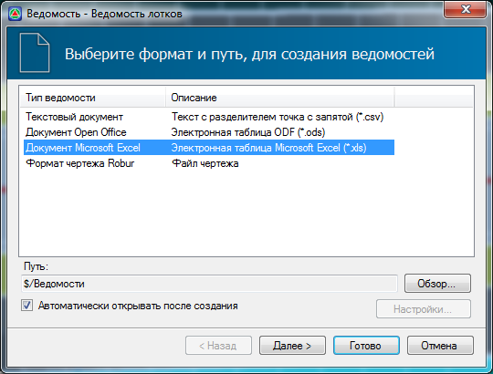
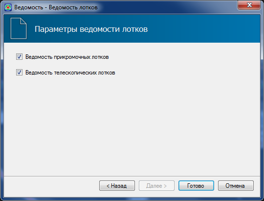
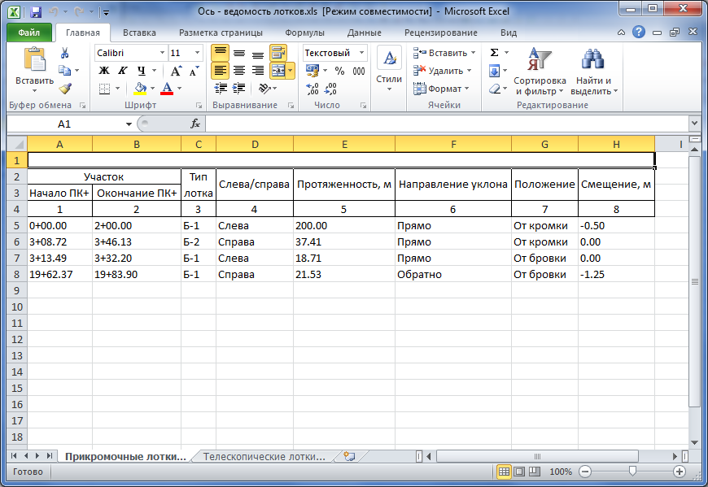
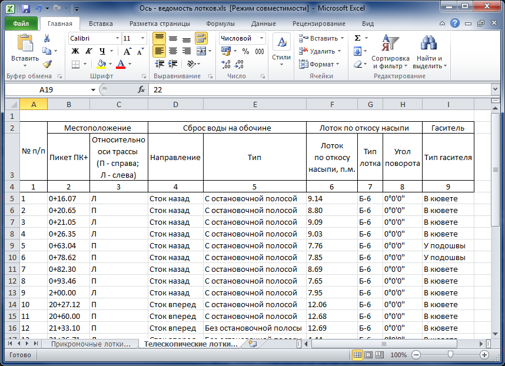

# Создание ведомости расстановки лотков

Для создания ведомости по лоткам:

1. Выберите элемент меню: **Задачи – Лотки – Ведомость лотков**.
2. Откроется стандартный мастер формирования ведомостей. Укажите необходимый формат ведомости и нажмите **Далее**:

   

3. На последнем шаге мастера выберите типы ведомостей которые необходимо создать и нажмите **Готово**:

   

В результате программа сформирует выбранные ведомости и откроет их в соответствующем редакторе.

Пример **ведомости прикромочных лотков**:

Пример **ведомости телескопических лотков**:

