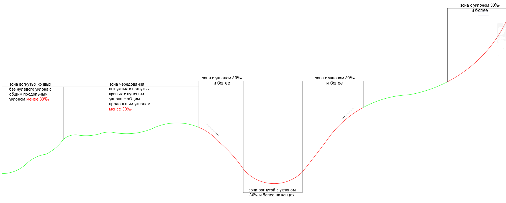
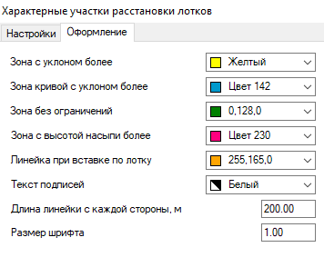
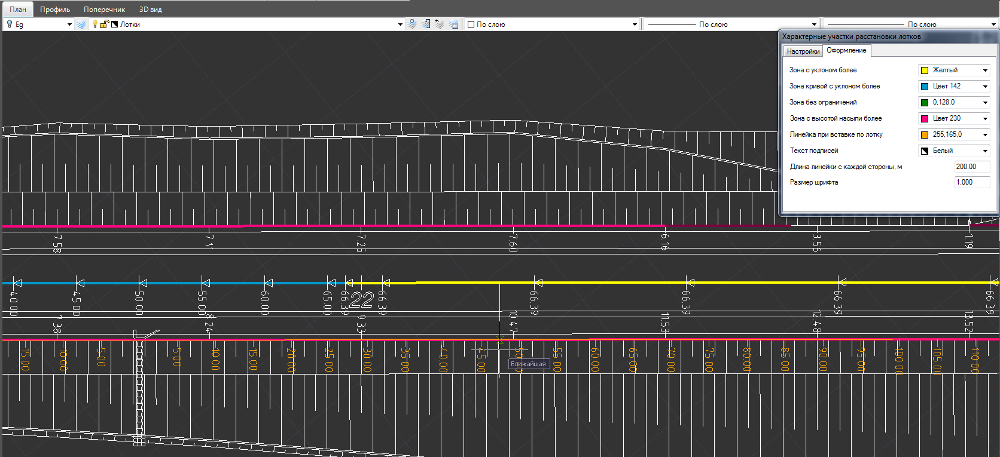
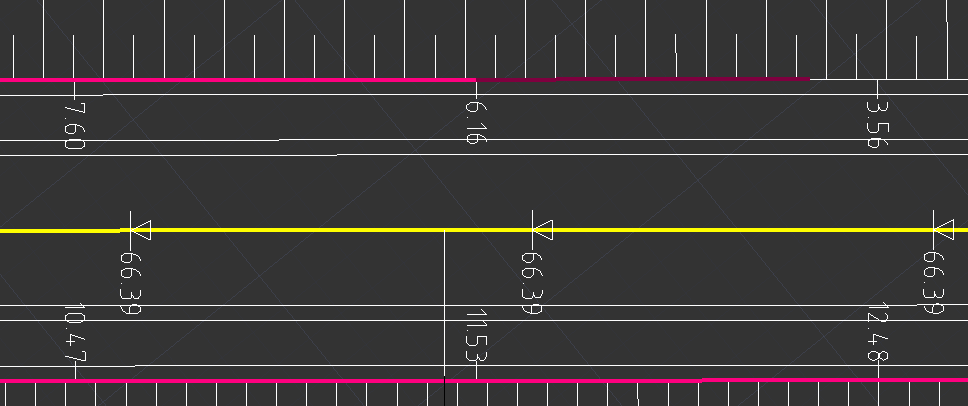

# Определение участков расстановки лотков (общие настройки)

Для более удобного и наглядного проектирования прикромочных и телескопических лотков в программе предусмотрен режим отображения характерных участков для их расстановки. При выборе функции **Добавить прикромочный лоток** или **Добавить телескопический лоток** этот режим запускается автоматически. В данном режиме открывается окно **Характерные участки расстановки лотков**, а на плане они начнут отображаться различными цветами:

Настройки критериев расчета и отображения характерных участков делается непосредственно в этом окне. На вкладке **Настройки** задаются критерии, по которым программа выделяет характерные участки. По умолчанию к характерным участкам относятся:

* **Зоны продольного профиля с уклоном более** 30 ‰.
* **Зоны вогнутых кривых, с уклоном на конце** 30 ‰ и более.

  Пример определения данных характерных участков продольного профиля показан на схеме ниже:

  

* **Зоны с высотой насыпи 4 м и более**.



 Высота насыпи вычисляется для каждой стороны дороги, как разность отметок бровки и подошвы. При наличии канавы, вместо отметки подошвы откоса принимается отметка ее дна.



При включении опции **Шаг уклона на кривых/ прямых** программа будет отображать значения продольных уклонов на плане. По умолчанию уклоны по вертикальным кривым отображаются с шагом в 5 ‰, а значения уклонов на прямых участках - с шагом в 20м.

При включении опции **Высота насыпи слева/ справа** программа отобразит на плане рабочие отметки по бровкам с каждого поперечника.

При установке галочки **Показывать уклон на виражах с шагом** программа покажет на плане поперечные уклоны на отгонах виража. К примеру, это может быть удобно для определения на плане участков с поперечными уклонами близкими к нулю.

На вкладке **Оформление** задаются настройки отображения на плане характерных участков. Здесь задается цветовая палитра различных характерных зон на профиле, а также цвет и высота текста подписей:

В поле **Длина линейки с каждой стороны** задается длина информационной линейки расстояний, показываемой при вставке одного телескопического лотка относительно другого:

Зоны с высотой насыпи более заданной величины обозначаются по следующему алгоритму:

Если на смежных поперечниках с одной стороны высота насыпи по бровке больше заданной, то программа будет считать, что на всем участке между поперечниками, с этой стороны высота насыпи больше заданной. Данный участок будет отображаться заданным на вкладке **Оформление цветом**.

Если на одном поперечнике высота насыпи по бровке больше заданной величины, а на соседнем меньше заданной величины, то программа с помощью линейной интерполяции найдет точку перехода через заданную высоту. Участок от поперечника с высотой больше заданной, до рассчитанной интерполяцией точки, будет подсвечиваться менее ярким цветом:

