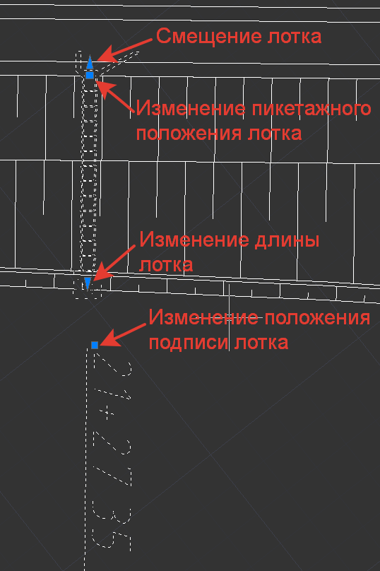
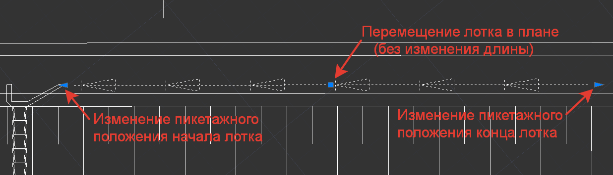
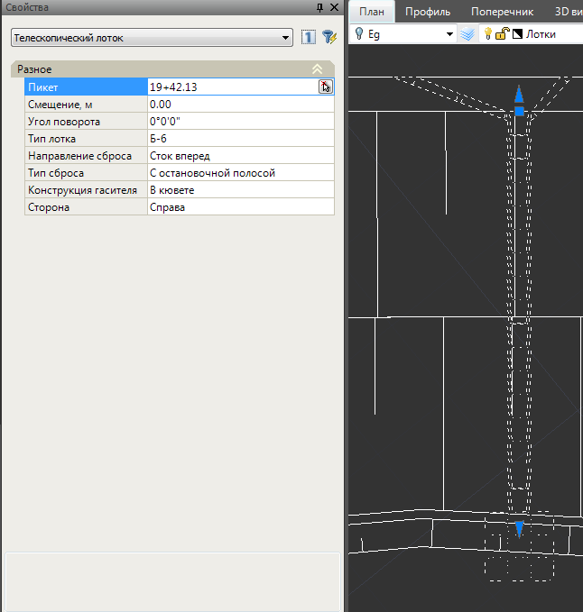
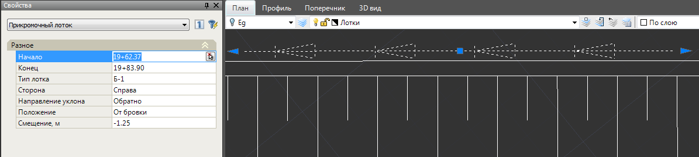
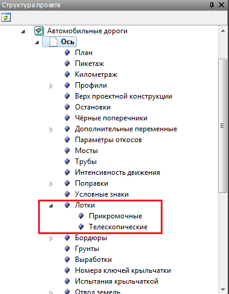
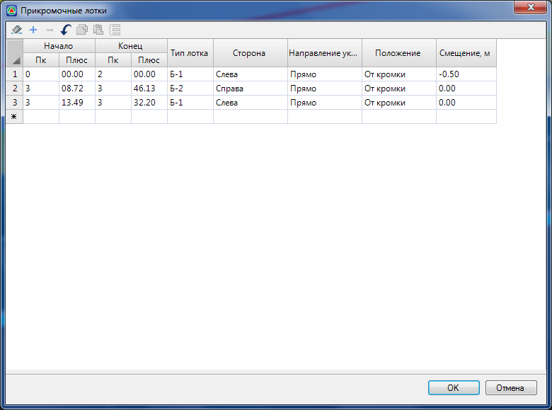
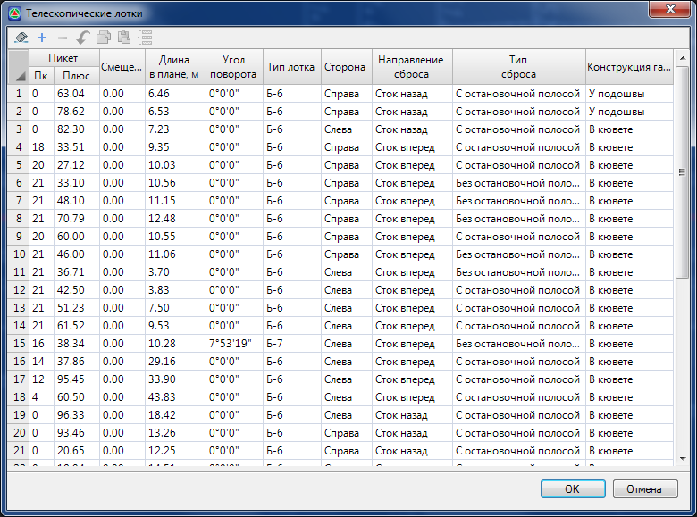
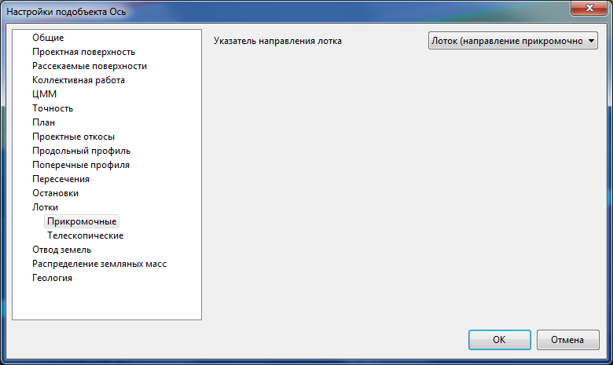
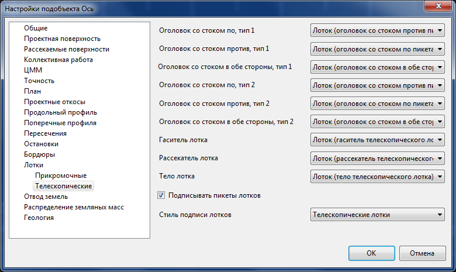

# Редактирование прикромочных и телескопических лотков

Редактирование лотков возможно визуальным способом с помощью гриппов в окне **План** и через панель **Свойства**.

Назначение гриппов по редактированию положения телескопического лотка показано на схеме ниже:

Гриппы для редактирования положения прикромочного лотка:

При выборе телескопического лотка на плане ряд его параметров могут быть изменены с помощью стандартного окна **Свойства**:

* **Пикет**- в данном поле можно назначить пикетаженое положение лотка.
* **Смещение**- задается величина смещения начала лотка относительно бровки. Данный параметр используется для случаев, когда водоотвод делается закрытым и на откос из тела насыпи выходит труба, вода из которой в последствии сбрасывается в сам лоток.
* **Угол поворота** - по умолчанию лоток вводится перпендикулярно оси трассы. В данном поле можно задать числовое значение угла поворота, а также указать его графически на плане.
* **Тип лотка, тип сброса, конструкция гасителя, направление сброса** - Варианты выбираемые в этих полях определяют соответствующий тип устройства, а также внешний вид телескопического лотка при его отображении в окне **План**.
* **Сторона** - в этом поле можно изменить сторонность лотка, если при вводе она была задана не правильно. Сторонность определяется по ходу пикетажа.

В свойствах прикромочного лотка можно изменить:

* **Начало и Конец** – в данных полях задаются пикеты начала и конца участка устройства прикромочного лотка.
* **Тип лотка** – выбирается соответствующий тип блоков прикромочного лотка.
* **Сторона** - задается сторонность лотка. Сторонность принимается по ходу пикетажа.
* **Направление уклона** - прямым считается направление по ходу пикетажа.
* **Положение** - лоток может располагаться относительно кромки или относительно бровки дороги.
* **Смещение** – задается величина смещения относительно кромки или бровки дороги. Смещение вправо считается положительным, смещение влево отрицательным. Например, прикромочный лоток нужно расположить на 1.25м. левее правой бровки. Для этого, в свойствах лотка задаются следующие параметры:

  + **Сторонность** – Право.
  + **Положение** - От бровки.
  + **Смещение** - -1,25.

Для того что бы удалить прикромочный или телескопический лоток выберите его на плане и нажмите **Delete**.

Введенные прикромочные и телескопические лотки хранятся в соответствующих таблицах структуры проекта.

Таблица **Прикромочные лотки**:

Таблица **Телескопические лотки**:

В данных таблицах при необходимости можно ввести новые лотки, а так же удалить или отредактировать уже введенные элементы.

Отображения лотков на плане настраивается в свойствах модели типа **Автомобильная дорога**. Для прикромочных лотков настраивается тип блока указателя направления лотка на плане:

Для телескопических лотков настраиваются блоки оголовков, лотков и гасителей. А также стиль подписей лотков на плане:

Введенные прикромочные и телескопические лотки по умолчанию отображаются на плане в слое **Лотки**.