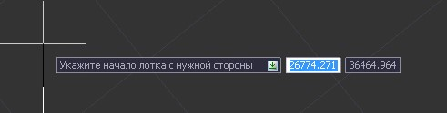
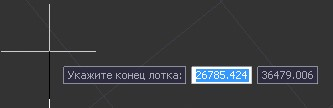
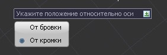
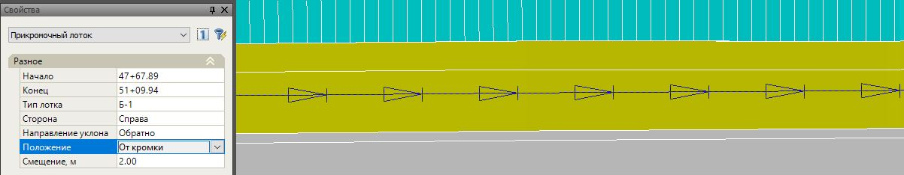
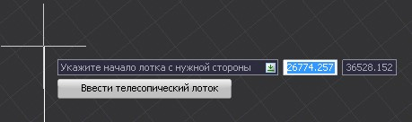

# Ввод прикромочных лотков

Для задания прикромочного лотка:

1. Выберите элемент меню **Задачи – Лотки – Добавить прикромочный лоток**.
2. Визуально с помощью левой кнопки мыши укажите начало и конец участка, на котором будут проектироваться лотки. В случае если участком является вся трасса, то нажмите правой кнопкой мыши и выберите соответствующий пункт. Автоматически откроется окно **Характерные участки расстановки лотков**.
3. Левой кнопкой мыши укажите визуально на плане начало прикромочного лотка с соответствующей стороны дороги:

   

4. Затем укажите конец лотка и границу элемента, относительно которой он будет откладываться (бровка или кромка):

   

   

5. При необходимости аналогичным образом задайте на плане положение следующих участков прикромочных лотков. Для выхода из режима ввода нажмите **Esc**.

В результате, введенные участки прикромочных лотков отобразятся на плане. Параметры выделенных участков при необходимости могут быть отредактированы в стандартном окне **Свойства**:



 При вводе прикромочного лотка, c помощью контекстного меню (Щелкнув правой кнопкой мыши) или окна динамического ввода также можно переключиться в режим ввода телескопических лотков:
 
 



Для выхода из режима ввода прикромочных лотков и закрытия окна **Характерные участки расстановки лотков** нажмите **Esc**.