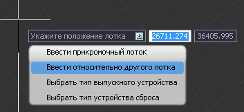
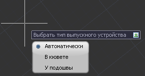
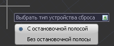
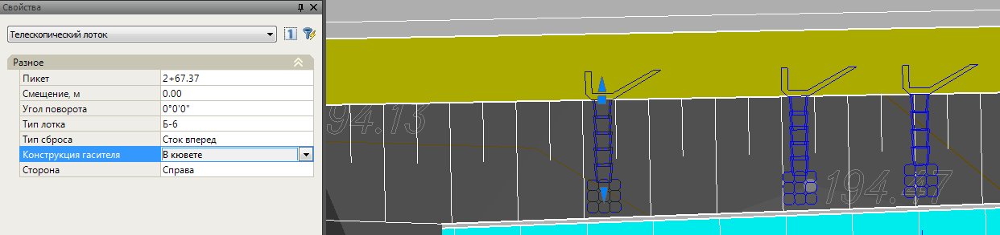

# Ввод телескопических лотков

Для задания телескопического лотка :

1. Выберите элемент меню **Задачи – Лотки – Добавить телескопический лоток**.
2. Визуально с помощью левой кнопки мыши укажите начало и конец участка, на котором будут проектироваться лотки. В случае если участком является вся трасса, то нажмите правой кнопкой мыши и выберите соответствующий пункт. Автоматически откроется окно **Характерные участки расстановки лотков**.
3. Левой кнопкой мыши укажите визуально на плане пикет установки телескопического лотка, а затем его сторонность.

   

   Сторонность приемного устройства на обочине программа подбирает автоматически в зависимости от продольного уклона трассы. Так же в зависимости от наличия кювета программа может автоматически подобрать тип выпускного устройства.

   

4. Для выбора дополнительных функций в режиме ввода телескопических лотков вызовите контекстное меню (Щелкнув правой кнопкой мыши) или откройте дополнительное меню в поле динамического ввода (нажав клавишу вниз на клавиатуре):

   

   Выберите пункт **Ввести относительно другого лотка** после этого укажите лоток относительно которого должен быть добавлен новый телескопический лоток. На плане относительно указанного лотка программа отобразит линейку расстояний, с привязкой к которой вводятся новые лотки. Для выхода из режима ввода одного лотка относительно другого нажмите **Esc**.

   **Выбрать тип выпускного устройства** – данный пункт позволяет указать программе, какой тип выпускного устройства следует автоматически принимать при вставке телескопического лотка. Возможны следующие варианты:

   * Программа будет автоматически, в зависимости от наличия на соответствующем пикете кювета, принимать тип выпускного устройства.
   * Также можно указать определенный тип выпускного устройства, которое программа будет принимать, не зависимо от наличия кювета в местах установки телескопических лотков:

     

   * Пункт **Выбрать тип устройства сброса** позволяет назначить тип устройства сброса воды на обочине, который программа будет принимать по умолчанию при добавлении телескопических лотков:

     

   * При выборе пункта **Ввести прикромочный лоток** программа из режима ввода телескопических лотков переключится в режим ввода прикромочных лотков.

В результате, введенные конструкции телескопических лотков отобразятся на плане. Параметры выделенных лотков при необходимости могут быть отредактированы в стандартном окне **Свойства**:

