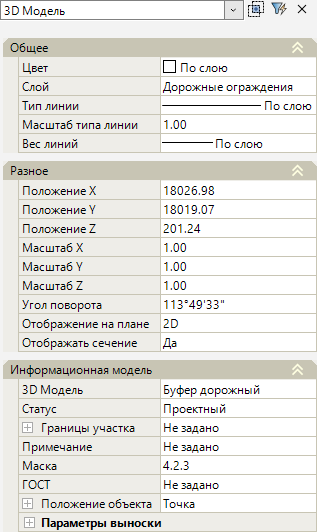
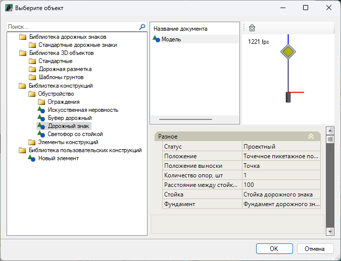
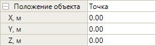
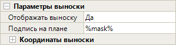
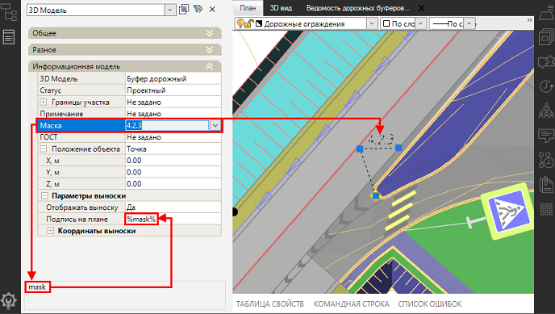
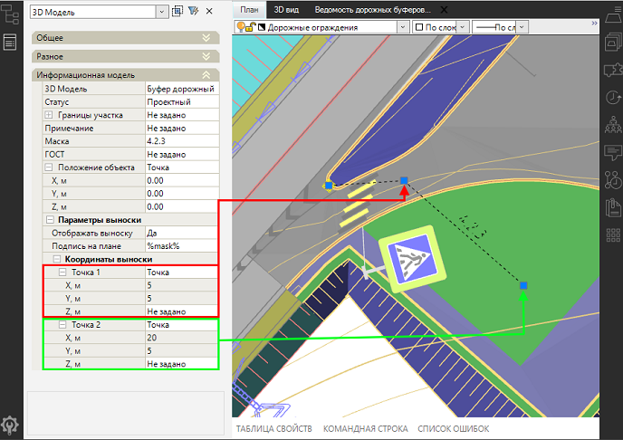

# Редактирование дорожного буфера

Положение дорожного буфера в рабочем поле можно изменить, перетащив его в нужное место за грип (), который появляется при выборе объекта. При этом условный знак буфера изменит свое положение, а координаты, пикетаж и смещение буфера не изменятся. 

Для изменения положения дорожного буфера с изменением координат, пикетажа и смещения, используйте базовую точку, которая появится после перемещения условного знака буфера.

Чтобы настроить параметры дорожного буфера, ЛКМ выберите его и откройте окно **Свойства**:

<u>**Общее**</u>

* В данном подразделе в поле **Слой** можно изменить слой дорожного буфера.

<u>**Разное**</u>

* В полях **Положение X/ Положение Y/ Положение Z** можно изменить координаты фактической точки вставки буфера. Ее изменение приводит к изменению координат и пикетажного положения буфера. Так же координаты точки могут задаваться графически. Для этого выделите поле с соответствующей координатой (**Положение X** или **Положение Y**) и нажмите кнопку , курсор будет привязан к точке вставки объекта, укажите требуемое положение точки.

* **Масштаб X/ Масштаб Y/ Масштаб Z** - в данных полях задаются значения масштабного коэффициента буфера. Влияет на его размер по координатным осям X,Y,Z.

* В поле **Угол поворота** можно изменить угол поворота буфера относительно оси Х. Угол поворота также можно задать визуально, для этого выделите поле и нажмите кнопку , курсор будет привязан к точке вставки объекта. Определите сторону поворота и нажмите ЛКМ.

* В поле **Отображения на плане** имеется возможность выбрать способ отображения объекта в окне **План**. Отображение может быть представлено в виде условного знака (если выбран параметр **2D**) или в виде трехмерной модели (при выборе параметра **3D**).

* **Отображать сечение** – данная опция позволяет включать (если выбрано значение **Да**) и выключать (если выбрано значение **Нет**) отображение буфера на продольном профиле и поперечных сечениях.

<u>**Информационная модель**</u>

В данной группе полей представлены основные свойства дорожного буфера.

* **3D модель** – в данном поле можно заменить вставленный буфер на другую 3D-модель, а так же открыть окно программы **Visual Studio Code**. Для этого:

  1. Чтобы заменить вставленный дорожный буфер на другую 3D-модель (например, на 3D-модель дорожного знака) выберите поле и нажмите , откроется окно библиотеки с элементами внутри. Выберите необходимый элемент, например дорожный знак, который находится в папках **Библиотека конструкций – Обустройство**. После чего нажмите **OK**:

     

  2. Редактировать имеющиеся или создавать новые параметрические 3D-модели можно при помощи **VS code** (Visual Studio Code), для этого выберите поле и нажмите , откроется окно программы **Visual Studio Code**, далее см. описание соответствующего раздела.

     

     Пиктограмма  будет отображаться в соответствующем поле, только в том случае, если установлена программа **Visual Studio Code**.

     

* **Статус** - по умолчанию статус объекта назначен как **Проектный**. Он учитывается при формировании выходных ведомостей. При необходимости смените этот параметр из выпадающего списка.

* **Примечание** - в данном поле можно добавить комментарий, который будет учитываться при формировании выходных ведомостей.

* **Маска** – в данном поле из списка можно выбрать вариант отображения маски дорожного знака *4.2.1, 4.2.2, 4.2.3* на буфере, выбранный вариант будет учтен при формировании ведомости и его можно будет просмотреть в окне **3D вид**. Ниже приведен пример дорожного буфера с назначенной маской 4.2.1:

  

* **ГОСТ** – в данное поле можно внести наименование нормативного документа, которое отобразится в ведомости.

* **Положение объекта** – в данной группе полей можно задать значения смещения буфера по осям X, Y, Z. Для этого раскройте поле, нажав знак . В открывшихся полях введите необходимые значения. При этом координаты, пикетаж и смещение буфера изменятся:

  

* **Параметры выноски** - в данной группе полей можно настроить отображение выноски в окне **План**. Для раскрытия поля нажмите знак :

  

  * **Отображать выноску** – при выборе в поле значения **Да** выноска будет отображена в плане, при выборе значения **Нет** выноска будет скрыта.
  * **Подпись на плане** – в данном поле можно редактировать содержимое подписи используя ссылку на тег того или иного свойства объекта. Чтобы отобразить содержимое свойства в надписи, необходимо заключить наименование тега в специальный символ - **%**.

    Например, в данном случае вставлена ссылка на тег поля **Маска** - `%mask%`, это значит, что содержимое поля **Маска** отобразится в подписи выноски ограждения:

    .

  * **Координаты выноски** – в данной группе полей отображаются значения смещения точки по осям X и Y в начале (поле **Точка 1**) и в конце (поле **Точка 2**) полки выноски относительно базовой точки объекта. Для раскрытия полей нажмите знак :

    
