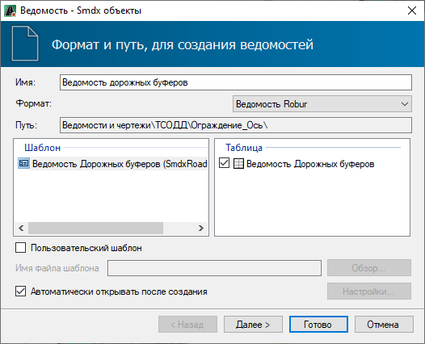
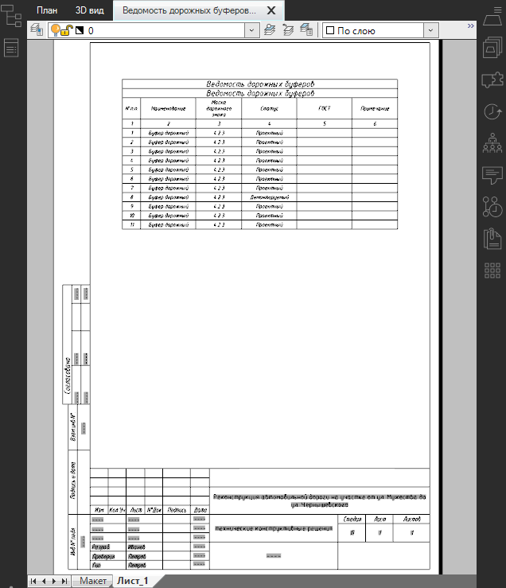

# Формирование выходных ведомостей

Функционал программы позволяет создавать ведомость дорожных буферов, для этого:

1. На ленте **Ограждения и Направляющие устройства** нажмите кнопку  (**Создать ведомость**), из выпадающего списка выберите ведомость **Дорожных буферов** (). Откроется окно стандартного мастера ведомости:

   

2. Выберите формат и шаблон ведомости, а так же при необходимости другие настройки , затем нажмите **Далее**.

3. На следующей вкладке активируйте опцию рядом с моделью **Обустройства**, где были установлены дорожные буферы. Если выбрать несколько моделей **Обустройства** с установленными дорожными буферами, то данные по этим буферам так же будут внесены в ведомость. Затем нажмите **Далее**.

4. Выберите формат листов, при необходимости заполните основную надпись и нажмите **Готово**.

5. Откроется окно, в котором введите наименование файла ведомости и нажмите **ОК**.

В результате ведомость будет сформирована и открыта в соответствующем редакторе.

Ниже отображен пример ведомости **Дорожных буферов**, сформированной в формате **Ведомость Robur** и открытой в соответствующем окне:

