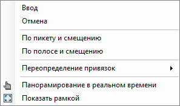
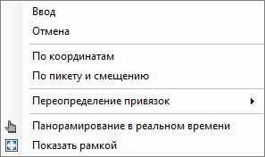

# Вставка дорожного буфера

Чтобы вставить дорожный буфер в рабочее поле:

1. В **Структуре проекта** сделайте активной соответствующую модель типа **Обустройство**.

   

   Подробное описание см. в разделе [Создание модели Обустройство](../create_traffic_safety_model.md)

   

2. На ленте **Ограждения и Направляющие устройства** или в меню **Обустройство – Ограждения и Направляющие устройства** выберите  (**Буфер дорожный**).

3. В рабочем поле ЛКМ укажите местоположение буфера или нажмите ПКМ и из появившегося контекстного меню выберите один из способов вставки объекта в рабочее поле:

   

   * При выборе **По пикету и смещению** курсор мыши будет привязан к оси линейного объекта. Курсором мыши определите сторону и место расположения буфера, в строке динамического ввода задайте пикет его расположения и нажмите **Enter**. Так же можно визуально указать точку вставки буфера, при этом в строке динамического ввода будет меняться пикетаж в зависимости от направления курсора мыши. Чтобы вставить буфер просто нажмите ЛКМ в нужном месте.

   * Режим **По полосе и смещению** позволяет расположить буфер на элементе дороги (полосе, кромки и т.д.) согласно заданному пикетажу.  
   При выборе данного режима курсор мыши примет форму прицела, ЛКМ выберите элемент дороги, например полосу, к которой будет привязан объект. Курсор мыши будет привязан к оси линейного объекта, в строке динамического ввода задайте пикет расположения буфера и нажмите **Enter**. Далее в строке динамического ввода введите значение смещения буфера, относительно полосы и нажмите **Enter**.

   

   Чтобы сменить режим вставки буфера на другой, после выбора режима (например, выбран режим **По полосе и смещению**), нажмите ПКМ и из контекстного меню выберите другой способ вставки:

   

   

В результате в рабочем поле отобразится дорожный буфер.