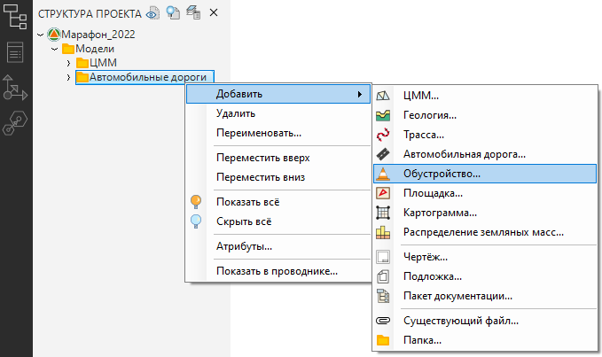
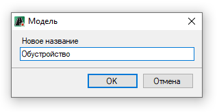
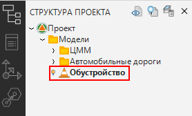

# Создание модели Обустройство

Объекты ТСОДД создаются в специализированной модели **Обустройство**. Создание отдельной модели позволяет более удобно организовать хранение данных в проекте, задавать необходимые настройки для модели, а также организовать коллективную работу, в случае, если нанесением объектов ТСОДД занимается отдельная группа специалистов, которая будет работать только со своими данными и в своей модели **Обустройство** (подробнее о коллективной работе над проектом см. раздел [Коллективная работа](../../../commons_tasks/collaborate/section_description.md)).



Возможность создания объектов ТСОДД в других моделях проекта (например, **Автомобильная дорога**) сохранена для совместимости с предыдущими версиями, а также для решения локальных задач отрисовки ТСОДД на плане, без необходимости детальных настроек и организации коллективной работы.



Чтобы создать модель типа **Обустройство**:

**1.** В окне **Структура проекта** нажмите ПКМ на любую из папок и выберите из появившегося контекстного меню **Добавить – Обустройство**:

   

**2.** В открывшемся диалоговом окне задайте имя модели и нажмите **ОК**:

   

В результате, в структуре проекта появится новая модель типа **Обустройство**:



Проект может содержать неограниченное число моделей типа **Обустройство**.  
   
 Описание действий над моделями проекта в окне **Структура проекта** см. [Запуск и настройка. Структура проекта](../../../install_startup/startup/structure_project/structure_project.md).

