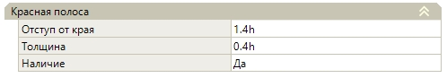
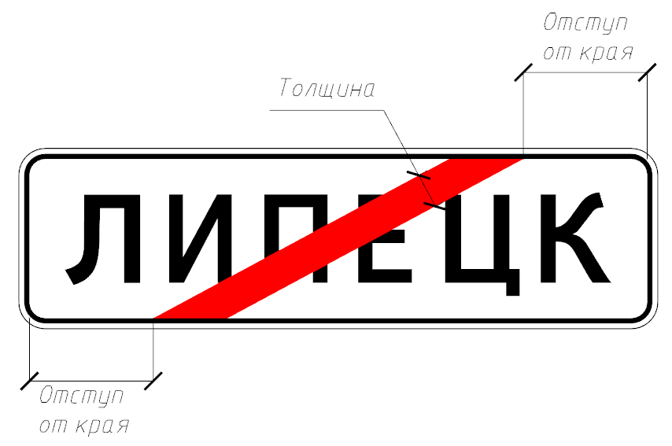
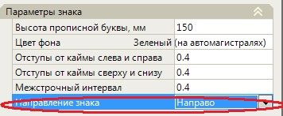
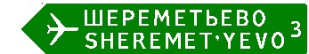
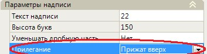
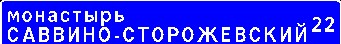
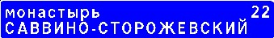
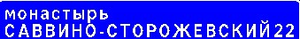
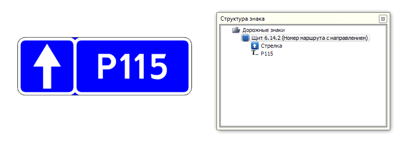
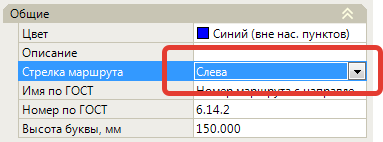

# Характерные особенности других знаков индивидуального проектирования

**Знак 5.24.1, 5.26 «Конец населенного пункта»**

Особенностью этих знаков является наличие красной полосы. В окне **Свойств**, помимо [общих свойств щита](description_common_elements_sign/properties_shield.md) появляется ряд новых опций, которые применяются для редактирования красной полосы:

* **Наличие**. В данном выпадающем списке задается наличие полосы на щите.
* **Отступ от края**. Задается величина отступа от каймы до края полосы слева и справа.
* **Толщина**. Задается толщина полосы.

**Знак 6.10.2 «Указатель направлений»**

Особенностью знака является его форма в виде стрелы. В окне **Свойств**, помимо [общих свойств щита](description_common_elements_sign/properties_shield.md) имеется параметр Направление знака:

**Направление знака**. Этот параметр позволяет менять направление знака. Возможно два варианта изменения направления: налево и направо.

#|
|||||
||Направо|Налево||
|#

**Знак 6.12 «Указатель расстояний»**

У элемента **Расстояние** имеется параметр **Прилегание**

#|
||||
||рис.4||
|#

**Прилегание**. Этот параметр используется, если Вставка содержит две и более строк текста. Текст может быть прижат вверх, вниз и по центру.

#|
||||||
||По центру|Прижать вверх|Прижать вниз||
|#

**Знак 6.14.1 и 6.14.1 «Номер маршрута»**

Данный тип шаблона щита состоит из элемента **Щит**, основные свойства которого были описаны в соответствующем разделе [Щит (общие свойства)](description_common_elements_sign/properties_shield.md), внутри которого имеется элемент **Текст** и **Стрелка**.

Отличительным свойством является возможность отображения элемента **Стрелка**, которая может располагаться слева или справа от номера маршрута:

Параметры элемента **Стрелка** и **Текст** редактируются через окно **Свойств** выделенного элемента. Подробно свойства этих элементов были описаны в разделе [Редактирование знаков индивидуального проектирования (на примере знака 6.10.1 «Указатель направлений»)](creation_signs_individual_design.md)