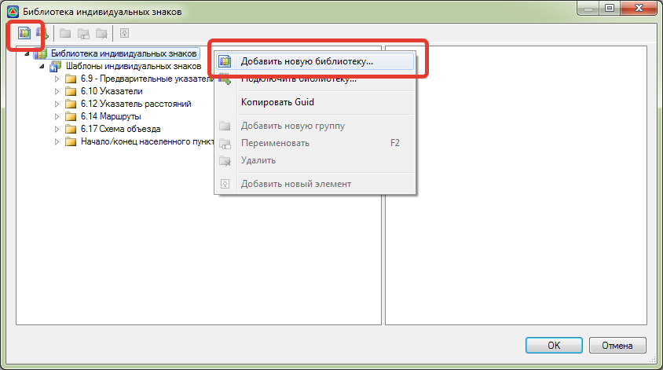
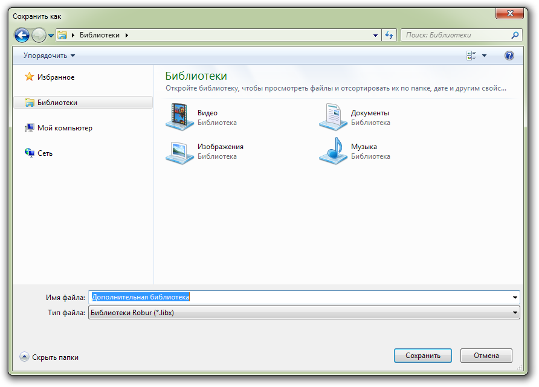
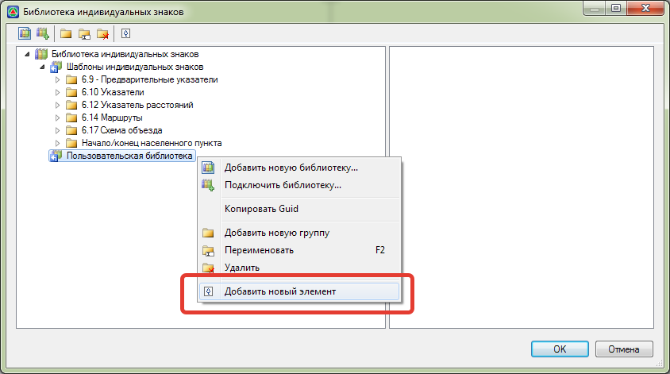

# Добавление шаблона в библиотеку индивидуальных знаков

## Для добавления шаблона знака индивидуального проектирования выполните следующие действия: ###

1. Выберите меню **Задачи - Индивидуальные знаки - Библиотека знаков**.
2. В открывшемся окне на верхней панели нажмите кнопку **Добавить новую библиотеку** или выберите соответствующий пункт контекстного меню:

   

3. Далее в открывшемся окне укажите название, место сохранения файла библиотеки и нажмите **Сохранить**:

   

4. В результате будет создана новая библиотека через контекстное меню в которую имеется возможность добавлять группы (подпапки) и новые элементы (шаблоны знаков):

   



 Файл шаблона индивидуального знака при подгруздке в библиотеку должен иметь формат **cds.** Сохранение щита знака в нужном формате подробно описано в соответствующей главе [Экспорт знака](export_sign.md).

