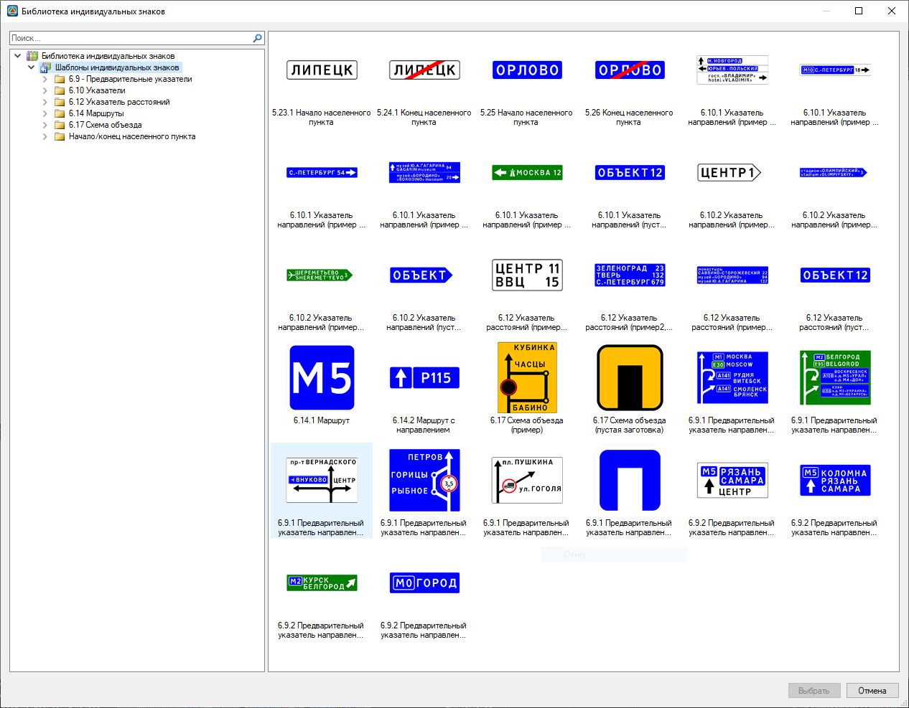
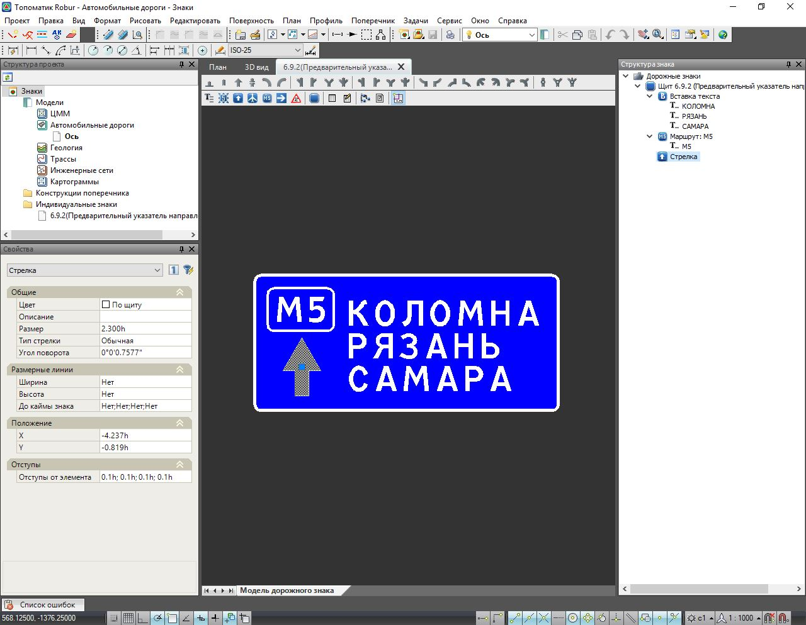

# Создание индивидуальных дорожных знаков

Для того чтобы создать новый проект индивидуального знака:

1. В **Структуре проекта** сделайте активной соответствующую модель типа **Обустройство**. 



Подробное описание см. в разделе [Создание модели Обустройство](../create_traffic_safety_model.md).



2. На ленте **Знаки и Светофоры** или в меню **Обустройство – Знаки и Светофоры** выберите команду **Новый индивидуальный знак**, откроется окно **Библиотеки индивидуальных знаков**:

   

   Для удобства работы, в библиотеке заготовлен набор шаблонов. Каждый шаблон имеет номер и название, соответствующее создаваемому знаку индивидуального проектирования. Причем одному знаку может соответствовать несколько шаблонов как пустая заготовка, так и полностью готовый знак, который в последствии может быть модифицирован. Пользователь может самостоятельно дополнять набор используемых шаблонов.

   

   Необходимый функционал по добавлению шаблонов описан в соответствующей главе [Добавление шаблона в библиотеку индивидуальных знаков](creating_templates_project.md).

   

3. Выберите необходимый шаблон знака, щелкнув по нему дважды левой кнопкой мыши. После этого на отдельной вкладке откроется выбранный шаблон.

