# Редактирование знаков индивидуального проектирования (на примере знака 6.10.1 «Указатель направлений»)

Характерные особенности подобного типа знаков (6.10. и 6.12.) заключается в том, что они состоят из элемента\элементов **Направление**, внутри которого имеется определенный набор элементов (**Текстовая вставка**, **Стрелка (справа\ слева)**, **Расстояние**, **Маршрут** и **Пиктограмма**). 

Выравнивание всех элементов на щите производится автоматически с учетом заданных Отступов, имеющихся Направлений, Вставок текста, наличия\отсутствия каких - либо элементов внутри них, их геометрических размеров и т.д.



 При необходимости проектирования знаков со свободной компоновкой элементов на щите, а также наличием каких либо элементов не характерных для знаков типа 6.10. и 6.12 (например наличие щитов стандартных дорожных знаков), необходимо создавать такой знак на основе любого шаблона знака из раздела «6.9 - Предварительные указатели».



Ниже приведены характерные особенности\свойства подобных знаков, состоящих из элементов **Направление**.

Для примера создадим новый проект индивидуального знака на основе имеющегося в библиотеке шаблона знака 6.10.1.



Создание нового проекта индивидуальных знаков подробно описано в соответствующей главе [Создание индивидуальных дорожных знаков](creation_individual_road_signs.md)



Выделив щит, в окне **Свойства** отобразятся параметры выделенного элемента:

* **Выравнивать дробную часть**. Включение данной опции (выбран пункт **ДА**) выравнивает все расстояния, располагая одинаковые разряды цифр друг под другом, при выключенной опции (выбран пункт **НЕТ**) выравнивание производится по правому краю.

  #|
  ||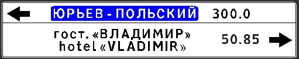|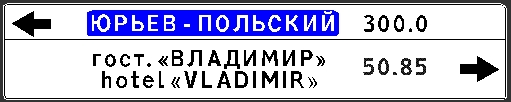||
  ||С выравниванием|Без выравнивания||
  |#

* **Разделять направления.** Параметр определяющий наличие полосы, которая отделяет направление друг от друга.

  #|
  ||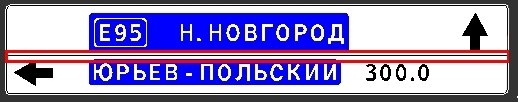|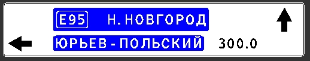||
  ||С разделяемой полосой|Без разделяемой полосы||
  |#



Описание остальных параметров щита приведены в соответствующей главе [Щит (общие свойства)](description_common_elements_sign/properties_shield.md).



## Добавление и свойства элемента Направление

Элемент **Направление** - это объект прямоугольной формы с определенным цветом фона, включающий в себя такие элементы как, **Стрелка (справа\слева)**, [Вставка текста](description_common_elements_sign/text_insertion.md) и **Расстояние до объекта**.



Ниже в текущем разделе документации подробно будет рассмотрена работа с перечисленными выше элементами.



Для добавления элемента **Направление**:

1. Выберите соответствующую кнопку **Направление**  на **Панели инструментов**.
2. Далее левой кнопкой мыши укажите Щит (место вставки) элемента. В результате в низу щита будет добавлен новый элемент **Направление**, внутри которого будет автоматически добавлен элемент.

[Вставка текста](description_common_elements_sign/text_insertion.md) с содержимым по умолчанию «Текст»:

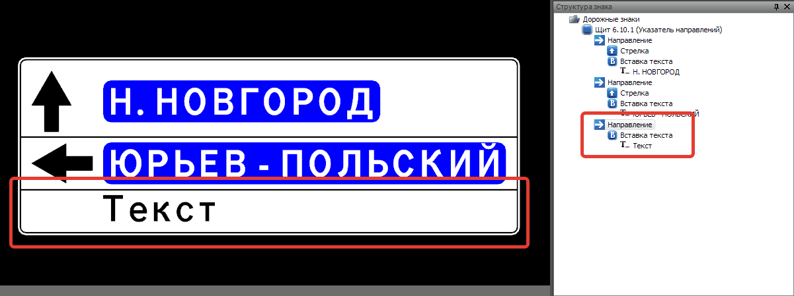

1. Выбрав элемент **Направление** в окне **Свойства** отобразятся параметры выделенного элемента: 

   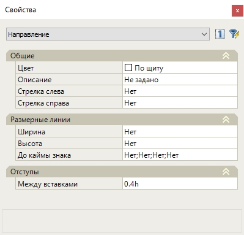

* **Цвет фона**. В данном выпадающем списке выбирается цвет фона выделенного элемента.

  

  Цвет элемента "По щиту" означает, что цвет для **Направления** будет принят таким который задан в **Свойствах** элемента [Щит](description_common_elements_sign/properties_shield.md).

  

* **Описание**. Текстовое поле предназначенное для дополнительного описания элемента, не является обязательным для заполнения.

* **Стрелка слева/ справа**. Задается наличие стрелок слева и справа.

  

  Ниже в текущем разделе документации рассмотрены альтернативные способы добавления и свойства элемента **Стрелка**.

  

* Работа с разделом **Размерные линии** подробно описана в главе [Размерные линии](dimension_lines.md).

* **Отступы между вставками**. В данном поле задается величина отступа между вставками.

Также часть функций можно задать через контекстное меню элемента **Направление**. Для отображения функций, в окне **Структура знака** нажмите правой кнопкой мыши по элементу **Направление**. Откроется контекстное меню:

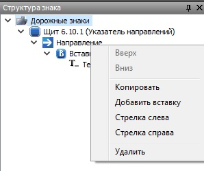

Функции контекстного меню элемента **Направления**:

**Вставка текста** - в щите 6.10.1 данный элемент имеет определенный набор функций, позволяющий добавить такие элементы как маршрут, пиктограмма и расстояние.

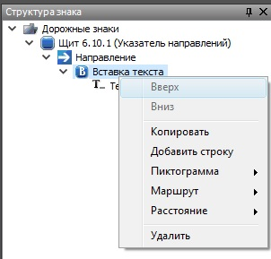



Перечисленные элементы будут описаны ниже. Более подробно работа с элементом Вставка текста написано [здесь](description_common_elements_sign/text_insertion.md).



**Стрелка слева/ справа** - данная функция задает стрелку с той или иной стороны.

**Копировать** - добавляет аналогичный элемент направление в структуру знака.

## Добавление и Свойства элемента Маршрут

Для добавления данного элемента:

1. Выберите соответствующую пиктограмму 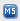 на **Панели инструментов**.
2. Укажите положение вставляемого элемента левой кнопкой мыши.
3. В результате элемент **Маршрут** будет добавлен:

   

   Элемент **Маршрут** добавляется слева от текста и внутри элемента [Вставка текста](description_common_elements_sign/text_insertion.md). 

   

   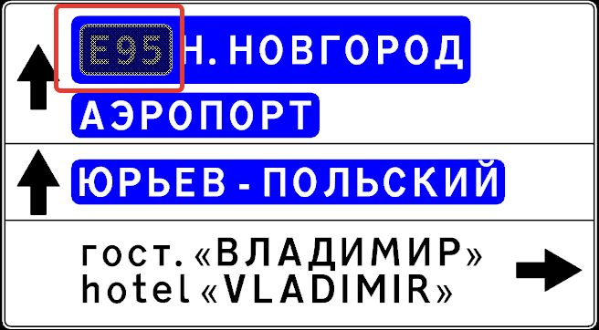

Для отображения и редактирования свойств элемента **Маршрут**, выберите необходимый элемент любым доступным способом. В окне **Свойства** появятся параметры выбранного элемента.

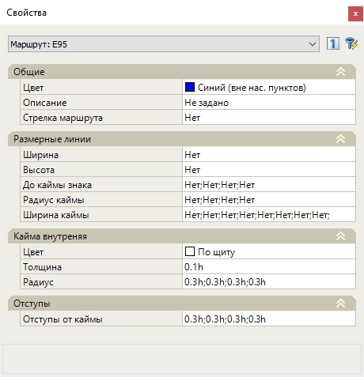

**Цвет фона**. В данном выпадающем списке задается цвет фона элемента **Маршрут**.

**Стрелка маршрута** данная функция добавляет стрелку в маршрут
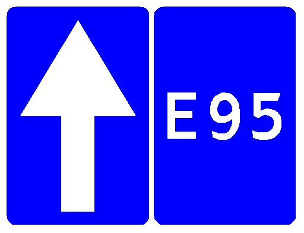

Такие параметры **Маршрута** как **Размерные линии**,**Кайма внутренняя** и **Отступы** задаются аналогично как у элемента **Щит**, которые подробно были описаны в разделе [Свойства щита](description_common_elements_sign/properties_shield.md). 

Для того чтобы отредактировать содержимое **Маршрута** выделите элемент **Текст** в **Структуре проекта** либо в **Рабочем окне**, далее в окне **Свойств** задайте необходимые данные. Редактирование текста маршрута происходит аналогично как редактирование текста вставки.

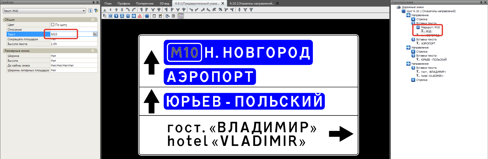



Редактирование положения (выравнивание) **Маршрута**, а также добавление\скрытие производится через окно **Свойства** выделенного элемента [Вставка](description_common_elements_sign/text_insertion.md) или через окно **Структура знака**.



## Добавление и свойства элемента Пиктограмма

Для добавления данного элемента:
1. Выберите соответствующую пиктограмму  на **Панели инструментов**.
2. Укажите положение вставляемого элемента левой кнопкой мыши.
3. В результате элемент **Пиктограмма** будет добавлен:

   

   Элемент **Пиктограмма** добавляется слева или справа от текста внутри элемента [Вставка текста](description_common_elements_sign/text_insertion.md). Сторонность добавления **Пиктограммы** определяется в зависимости от того к какому краю ближе был расположен курсор мыши в момент добавления элемента. 

   

   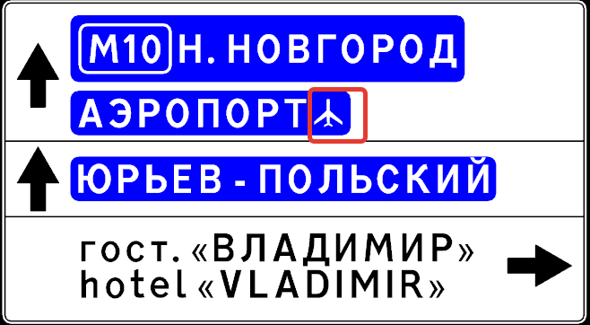

Для отображения и редактирования свойств элемента **Пиктограмма**, выберите необходимый элемент любым доступным способом. В окне **Свойства** появятся параметры выбранного элемента:

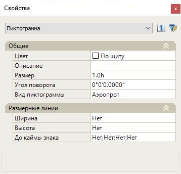

* **Цвет**. Выпадающий список для задания цвета пиктограммы.
* **Описание**. При необходимости задается текстовое описание элемента.
* **Размер**. В данном поле задается размер пиктограммы.

  

  По умолчанию размер **Пиктограммы** определяется относительно высоты прописной буквы заданной в Свойствах элемента [Щит](description_common_elements_sign/properties_shield.md).

  

* **Угол поворота**. Для пиктограммы можно задавать угол поворота, который соответствует реальному направлению. Угол задается от 0 до 359. Отсчет против часовой стрелки.

  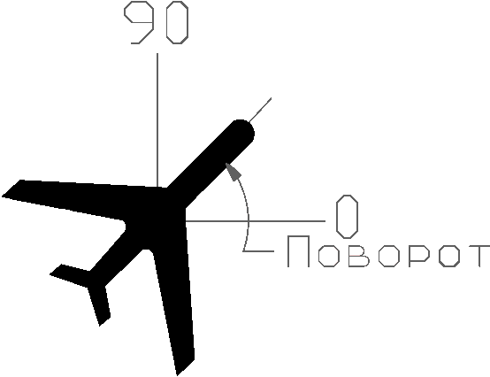

* **Вид пиктограмма**. Из выпадающего списка выбирается вид пиктограммы.
* Работа с расстановкой размерных линий описана в главе [Размерные линии](dimension_lines.md).



Редактирование положения **Пиктограммы**, а также ее добавление\скрытие производится через окно **Свойства** выделенного элемента [Вставка](description_common_elements_sign/text_insertion.md) или через окно **Структура знака**.



## Добавление и Свойства элемента Расстояние

Для добавления элемента Расстояние:
1. Выберите соответствующую кнопку 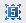 на **Панели инструментов**.
2. Далее левой кнопкой мыши укажите место вставки элемента.
3. В результате будет добавлен новый элемент в виде текстового объекта с содержимым по умолчанию «100»:

   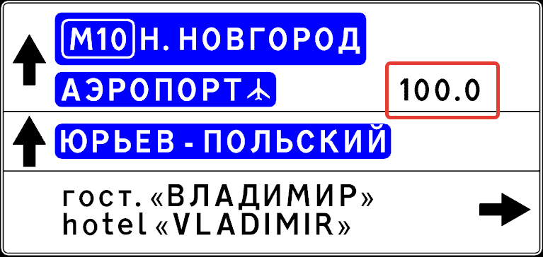

Для отображения и редактирования свойств элемента **Расстояние**, выберите необходимый элемент любым доступным способом. В окне **Свойства** появятся параметры выбранного элемента.



Элемент **Расстояние** обладает набором параметров аналогичных как у элемента **Текст**, которые были подробно описаны в главе [Вставка текста](description_common_elements_sign/text_insertion.md).



## Добавление и Свойства элемента Стрелка

Для добавления элемента:
1. Выберите соответствующую кнопку  на **Панели инструментов**.
2. Далее левой кнопкой мыши укажите место вставки элемента.
3. В результате будет добавлен новый элемент.

   

   Элемент **Стрелка** добавляется слева или справа от текста внутри элемента [Вставка текста](description_common_elements_sign/text_insertion.md). Сторонность добавления **Стрелки** определяется в зависимости от того к какому краю ближе был расположен курсор мыши в момент добавления элемента. 

   

   #|
   ||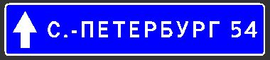|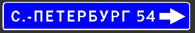||
   ||Стрелка слева|Стрелка справа||
   |#

Для отображения и редактирования свойств элемента **Стрелка**, выберите необходимый элемент любым доступным способом. В окне **Свойства** появятся параметры выбранного элемента:

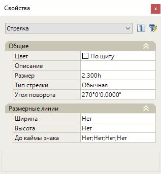

* **Цвет**. Выпадающий список для задания цвета элемента.
* **Описание**. При необходимости задается текстовое описание элемента.
* **Размер**. В данном поле задается размер стрелки.

  

  По умолчанию размер **Стрелки** определяется относительно высоты прописной буквы заданной в Свойствах элемента [Щит](description_common_elements_sign/properties_shield.md).

  

* **Угол поворота**. в Данном поле задается угол поворота, который соответствует реальному направлению. Угол задается от 0 до 359. Отсчет против часовой стрелки.
* **Тип стрелки**. Задает вид указателя стрелки.

  Например: Обычная или Укороченная за счет стержня.

  | Обычная | Укороченная |
  | --- | --- |
  |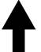|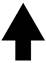|

* Работа с расстановкой размерных линий описана в главе [Размерные линии](dimension_lines.md).