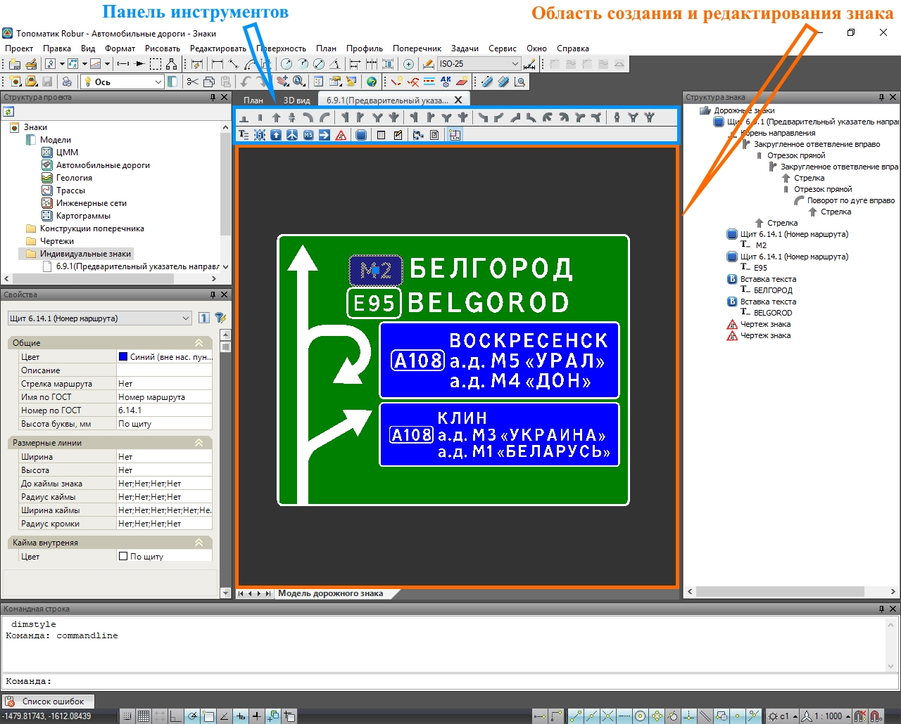

# Описание интерфейса

Главное окно редактора состоит из следующих частей:

1. **Область создания и редактирования знака**. В этой области производится работа с элементами знака индивидуального проектирования.

1. **Структура знака**. В данном окне в виде древовидной структуры представлен набор элементов индивидуального знака. Окно **Структура знака** может быть открыто путем выбора элемента меню **Задачи - Индивидуальные знаки - Структура знака** или с помощью соответствующей иконки  на Панели инструментов.

1. **Панель инструментов**. В данной области располагаются кнопки, которые предназначены для быстрого добавления различных элементов знака (Текста, Пиктограмм и т.д.).

1. **Свойства**. В этом окне отображаются параметры выбранного элемента знака. Подробно свойства каждого элемента будут рассмотрены в соответствующих разделах документации.



Также могут быть открыты дополнительные окна **Командная строка**, **История** и т.д, их отображение производится через меню **Вид**.



