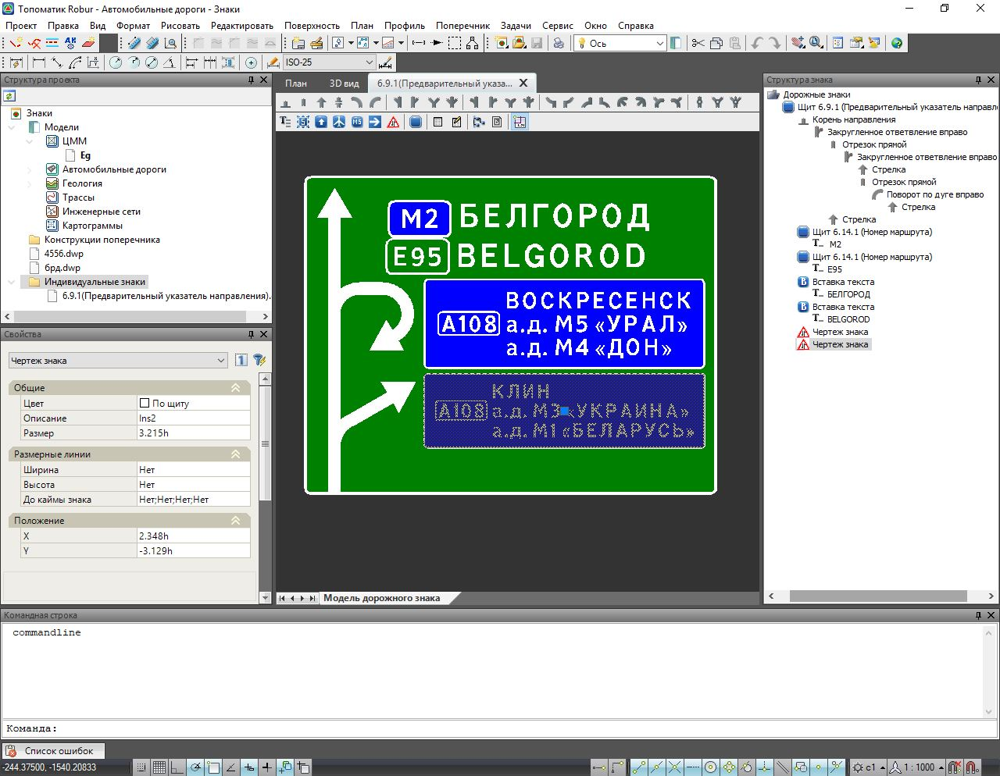
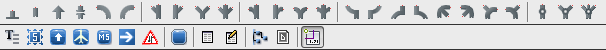
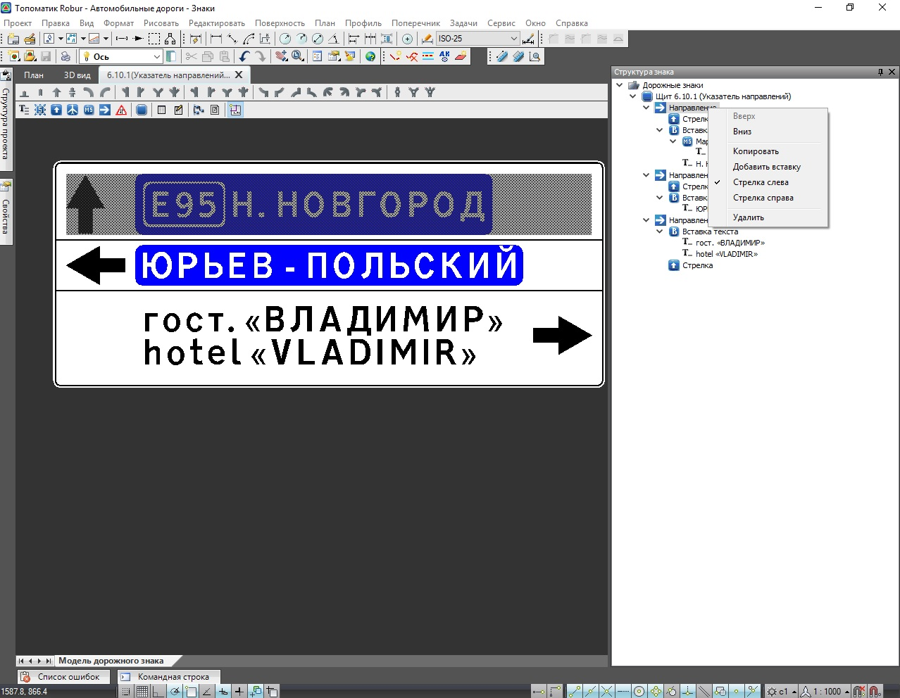

# Описание структуры знака, общие механизмы редактирования и добавления элементов

Знак представляет собой совокупность элементов, вложенных в древовидную структуру. Элементы условно можно поделить на Общие (имеются во всех типах знаков) и Характерные (имеются у определенных типов знаков). К общим элементам относятся - **Вставка текста** и **Щит**, к характерным - **Направление, Стрелка, Номер маршрута и тд**.



Используемый набор элементов зависит от выбранного шаблона щита знака.



Редактирование каждого элемента осуществляется через окно **Свойства**. Выбор необходимого элемента для его последующего редактирования может быть осуществлен как в **Рабочем окне** так и через окно **Структура знака**.

Добавлять элементы (Маршруты, Пиктограммы, Текстовые вставки и т.д.) можно с помощью **Панели инструментов** выбирая соответствующие кнопки:

Для многих элементов функции редактирования\добавления имеются непосредственно в окне **Структура знака**. Для вызова необходимых команд нажмите правой кнопкой мыши по одному из элементов в окне **Структура знака** и из контекстного меню выберете необходимую функцию:



На рисунке выше приведены основные функции контекстного меню элемента **Направление**. Далее в соответствующих разделах функции по каждому элементу будут описаны более подробно.

