# Размерные линии

## Общие сведения

В данном разделе документации приводится описание механизмов расстановки и редактирования размерных линий.

Размерные линии можно поделить на два вида:

1. **Размерные линии стандартных элементов.** Данные размерные линии привязаны к элементу (Вставки текста, Щиту, Пиктограмме и т.д), они динамические (пересчитываются в случае изменения параметров элемента) и предназначены непосредственно для задания размеров у стандартных элементов через окно Свойства. 

2. **Произвольные размерные линии.** Данные размерные линии не привязываются в какому либо элементу, соответственно динамически не пересчитываются, а их расстановка производится в любом месте щита. С помощью данных размерных линий проставляются, например, какие то вспомогательные размеры или размеры между различными элементами щита. Имеется несколько видов размеров (Параллельный, Линейный, Угловой и т.д.).

## Размерные линии стандартных элементов

Для отображений размерных линий у стандартных элементов:

1. Выделите нужный элемент, выбрав его в рабочем окне или в **Структуре знака**. 

2. В окне **Свойства** в поле параметра **Размерные линии**, установите местоположение размерной линии. Для этого выберите положение размерной линии из выпадающего списка или дополнительного окна:

   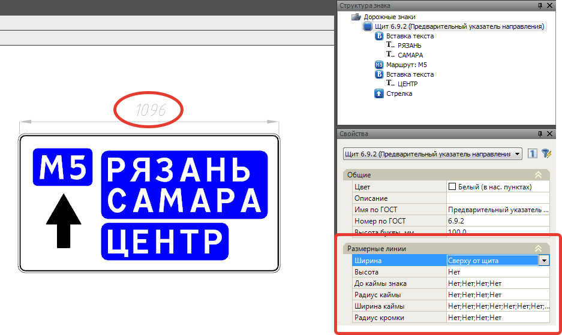

Особенностью данных размерных линий является то, что они могут быть отрисованы либо «от элемента», либо «от щита». Необходимый вид отображения задается путем выбора соответствующего пункта в выпадающем списке.

Пример отображения размера «от элемента», т.е. выбран размер для параметра Высота вставки - «Справа»:

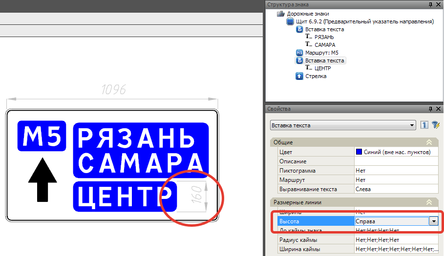

Пример отображения размера «от щита», т.е. выбран размер для параметра Высота вставки - «Справа от щита»:

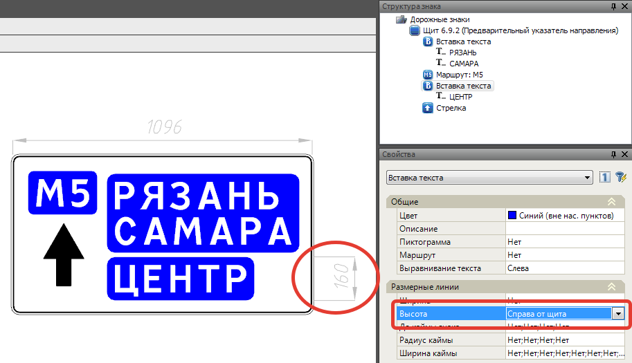



Способ отображения размеров «от щита» позволяет расставить размеры не загромождая выносными линиями пространство щита.



Далее будут подробно рассмотрены размерные линии каждого элемента.

### Размерные линии элемента Щит

В окне Свойства для элемента Щит доступны следующие размерные линии:

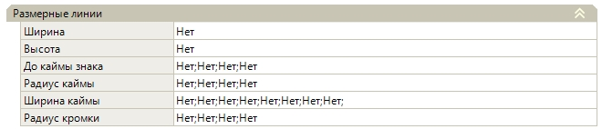

Размеры схематично показаны на рисунке ниже:

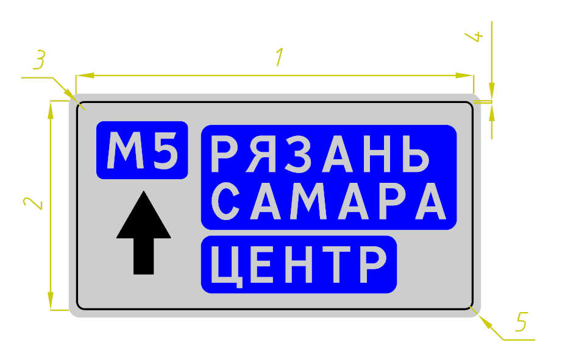

* 1 - Ширина щита.
* 2 - Высота щита.
* 3 - Радиус внутренней каймы.
* 4 - Ширина внутренней каймы.
* 5 - Радиус внешней каймы.
* 6 - До каймы знака.



Размер «До каймы знака» можно будет задать в случае когда щит вставлен внутри другого щита:

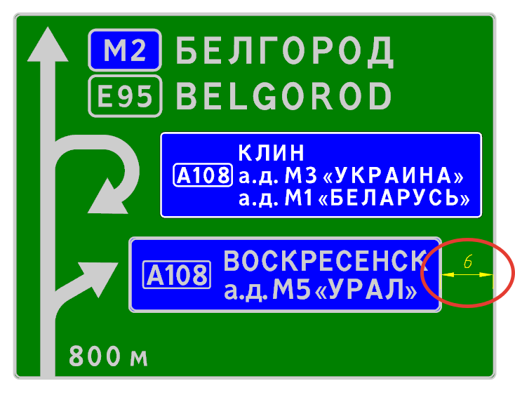



### Размерные линии элементов Направление, Стрелка, Пиктограмма

Для элементов **Направление**,**Стрелка** и **Пиктограмма** параметры задания и отображения размерных линий одинаковы.

На примере ниже показано отображение размерных линий на примере элемента **Стрелка**.

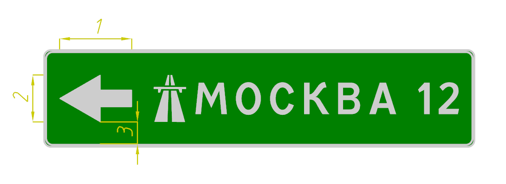

* 1 - Ширина элемента.
* 2 - Высота элемента.
* 3 - До каймы знака.



Размеры Ширина и Высота стрелки заданы «от щита».



### Размерные линии Вставка, Маршрут

Параметры задания и отображения размерных линий у элементов **Вставка текста** и **Маршрут** одинаковы. На примере ниже отображение размерных линий у элемента **Вставка текста**.

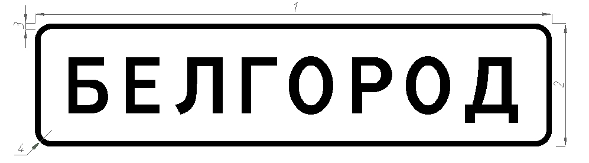

* 1 - Ширина вставки.
* 2 - Высота вставки.
* 3 - Ширина каймы.
* 4 - Радиус каймы.
* Расстояние до каймы знака работает аналогично, как и расстояние до каймы вставки.

### Размерные линии Текст (Расстояние)

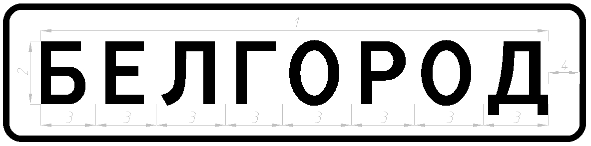

* 1 - Ширина текста.
* 2 - Высота текста.
* 3 - Ширина литерных площадок.
* 4 - Расстояние до каймы вставки.

## Произвольные размерные линии

Расстановка произвольных размерных линий производится путем выбора необходимого типа размера через меню **Рисовать - Размеры - ...** или специализированную **Панель инструментов**:

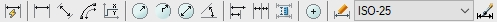



Отображение дополнительных панелей подробно описано в соответствующей главе [Интерфейс программы Топоматик Robur](../../../../install_startup/startup/startup_program/interface_program.md).



## Редактирование и стили размерных линии

Положение размерных линий можно редактировать, для этого имеются специальные вершинки (грипы), с помощью которых, зажав левой кнопкой мыши, можно корректировать положение размера  и делать выноски .

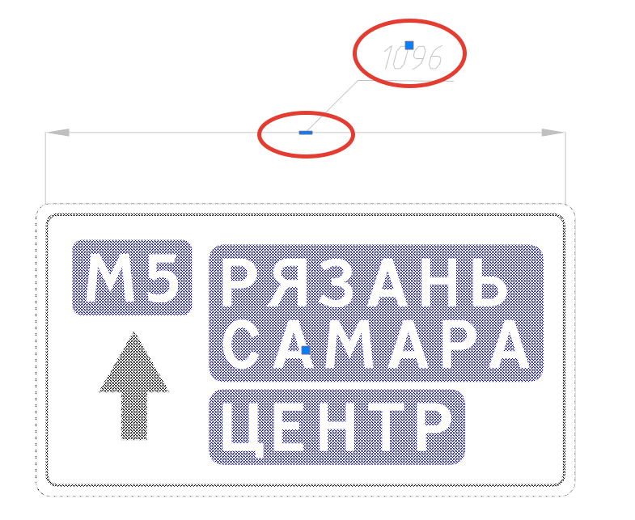

* Для «произвольных размерных линий» может быть создан и назначен любой размерный стиль. Подробное описание механизмов создания **Размерных стилей** описано в главе [Инструменты работы со слоями](../../../../install_startup/startup/working_with_layers_model/tool.md).

* «Стандартные размерные линии» отрисовываются определенным размерным стилем с названием «Signs»:

  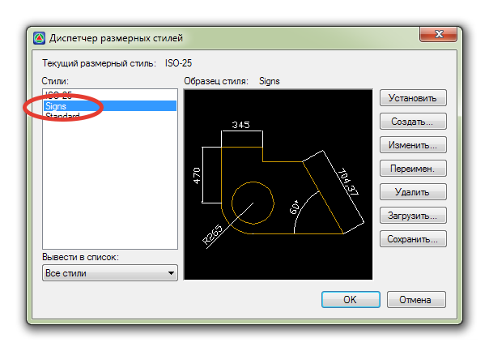

поэтому при необходимости внесения изменений, производить их нужно непосредственно в данном стиле «Signs».