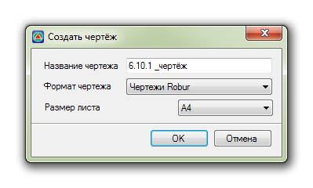
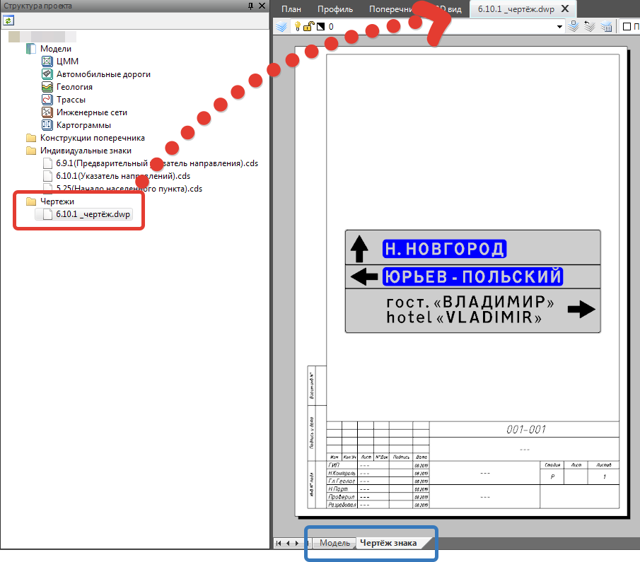

# Создание чертежа знака

Данная функция позволяет создать чертеж знака.

Для этого:

1. Нажмите на **Панели инструментов** соответствующую кнопку  **Создать чертеж**.
2. В открывшемся окне необходимо задать параметры чертежа, такие как **Название файла**, **Формат**, **Размер листа** и нажать **ОК**:

   

3. В **Структуре проекта** будет создана папка в которую сохранится файл чертежа знака, двойным кликом мыши его можно открыть в отдельной вкладке:

   



Файл чертежа будет состоять из вкладки Модель и Лист. Пользовательский масштаб видового экрана на вкладке Лист будет подобран автоматически исходя из размера щита знака и выбранного формата листа (А4, А3 и т.д.) при создании чертежа, при этом подбираемый масштаб будет кратен 10, т.е. 1:10, 20, 30 и т.д.

