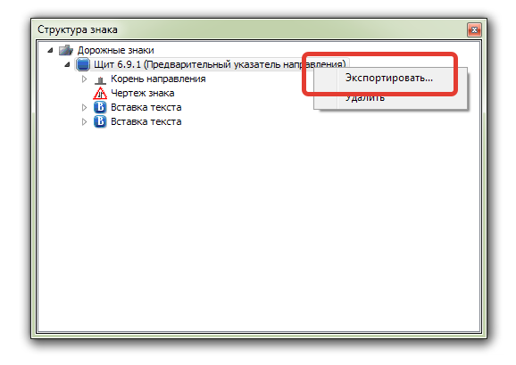

# Экспорт знака

Функция экспорта щита знака предназначена для сохранения его в качестве шаблона индивидуального знака, а также для сохранения и добавления его в библиотеку стандартных дорожных знаков для последующего использования (вставка в окне План) в проекте Топоматик Robur - Автомобильные дороги.

Для этого:

* В окне **Структура знака** щелкнете правой кнопкой мыши по необходимому щиту и из контекстного меню выберите команду **Экспортировать**:

  

* Далее в открывшемся окне укажите имя и тип файла, после чего нажмите кнопку **Сохранить**.



* При экспорте в формате **.cds** программа экспортирует знак, который в дальнейшем можно будет погрузить в библиотеку индивидуальных знаков в качестве шаблона. Подробнее последовательность действий описана в соответствующей главе [Добавление шаблона в библиотеку индивидуальных знаков](creating_templates_project.md).

* При выборе типа файла **.dwp** программа экспортирует файл в качестве элементов чертежа без размерных линий в масштабе 1:100. В дальнейшем данный файл можно подгрузить в библиотеку дорожных знаков. Подробнее последовательность действий описана в соответствующей главе [Добавление дополнительных знаков в библиотеку](../standard_road_signs_new/adding_additional_characters_to_library.md).


